# LANE RESERVE 操作マニュアル（レーンリザーブ）

美容皮膚科の受付・看護師・医師・院長が使う予約管理アプリ **「LANE RESERVE（レーンリザーブ）」** の使い方です（以前は「予約カレンダー」という名前でした）。ブラウザのタブの題名・ホーム画面に追加したときの名前とアイコンも「LANE RESERVE」です。
はじめて触る人（スタッフ、またはこのアプリを操作するAI）が、この1冊で毎日の仕事をできるように書いています。

> **画面の写真について**
> 写真はすべて、開発用の **架空のデモデータ**（デモ皮フ科・架空の患者）で撮ったものです。実在の患者は写っていません。
> 撮影日は 2026年10月9日（金）と 10月14日（水）の画面です。院ごとの設定（配色・レーン名・メニュー）によって、見た目は少し変わります。
>
> **【未確認】** と書いてある所は、コードには機能があるものの、デモ環境では画面で動きを確かめられなかった所です。本番で使う前に確かめてください。

---

## 目次

1. [はじめに](#1-はじめに)
2. [ログイン](#2-ログイン)
3. [画面の見方](#3-画面の見方)
4. [予約を入れる](#4-予約を入れる)
5. [予約を動かす・長さを変える](#5-予約を動かす長さを変える)
6. [来院から会計までの状態の付け方](#6-来院から会計までの状態の付け方)
7. [キャンセル](#7-キャンセル)
8. [患者を探す・登録する・編集する](#8-患者を探す登録する編集する)
9. [問診票](#9-問診票)
10. [カルテ・同意書・見積](#10-カルテ同意書見積)
11. [1日の流れ（朝・診療中・終業）](#11-1日の流れ朝診療中終業)
12. [スマホでの使い方](#12-スマホでの使い方)
13. [設定（院長・管理者向け）](#13-設定院長管理者向け)
14. [困ったとき（FAQ）](#14-困ったときfaq)
15. [役割ごとにできること](#15-役割ごとにできること)
16. [AI・開発者向けメモ](#16-ai開発者向けメモ)

---

## 1. はじめに

### このアプリでできること

- 1日の予約を、**レーン（列）ごと・時間ごと**に1画面で見る
- 空いている所を押して予約を入れる。ドラッグで時間やレーンを変える
- 来院・待ち・施術中・会計待ち・帰宅などの **状態** を付けて、院内で進み具合を共有する
- 患者の基本情報・注意事項・施術歴（簡易カルテ）・問診票・同意書・見積書を1か所で見る
- だれが何を変えたかを記録する（患者情報の中身は記録に残しません）

パソコン・タブレット・スマホのブラウザで使います。ほかの端末で変えた内容は **20秒ごと** と、画面に戻ったときに自動で読み直されます。

### 用語

| 用語 | 意味 |
| --- | --- |
| **レーン** | 予約表の縦の列。施術を行う場所や担当のまとまり（例：メインレーン（医師）、1番レーン（レーザー脱毛など））。院長・管理者が設定で増やしたり名前を変えたりできます |
| **枠（予約枠）** | 予約表の上の四角。1つが1件の予約です。高さが時間の長さです。短い枠は「患者名｜施術の略称」の1行で表示されます |
| **Todaysメモ** | 予約表の一番上（診療開始の時刻より上）にある、レーンごとの「その日のメモ」欄。担当スタッフやその日の注意点を書きます |
| **受付メモ** | 左の受付一覧の各患者の行にある、その日だけのメモ（進み具合など）。患者情報のメモとは別です |
| **診察券番号** | 患者ごとの番号。院では **M3（電子カルテ）のカルテ番号と同じ番号** として扱う想定です。アプリには「診察券番号」と「M3カルテ番号」の2つの欄があり、2つが違うときだけ予約の詳細に「M3 ○○」が別に出ます（運用は院で確認してください）。新しく登録した患者には、アプリが番号を自動で振ります |
| **状態** | 予約の進み具合。初期は「予約・来院済・医師待ち・看護師待ち・撮影待ち・麻酔待ち・診察中・処置中・待機中・検討中・会計待ち・帰宅」と、自由な一言の「自由入力」。院で名前・色・数を変えられます |
| **キャンセル／無断キャンセル** | 取り消した予約。予約表からは消えます（「キャンセル表示」で薄く表示でき、押すと詳細が開いて「予約に戻す」ができます） |
| **管理操作** | 設定の変更や患者の削除・統合などの操作。院長・管理者と受付ができ、院長がほかのスタッフに許可することもできます（[15章](#15-役割ごとにできること)） |

---

## 2. ログイン

院の入口でパスワード（Basic認証）を聞かれる場合は、院で決めたものを入れます（設定されていなければ聞かれません）。そのあと、スタッフごとにログインします。

ログイン画面の上には **LANE RESERVE のロゴ**（赤枠）が出て、ブラウザのタブの題名は「ログイン｜LANE RESERVE」になります。

1. 一覧から **自分の名前**（①）を押します。 
2. 数字のボタンで **PIN** を入れます（①）。間違えたら「⌫」で1文字消します。
3. **OK**（②）を押すと予約表が開きます。 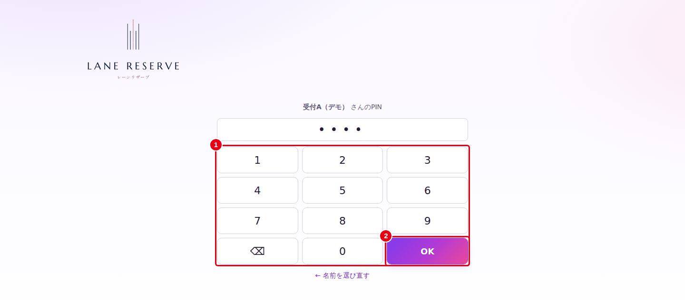

- ログインは **12時間** 有効です。過ぎるともう一度ログインします。
- スタッフを交代するときは、予約表の右上の **「名前 ⇄」** を押し、確認で OK を押すとログイン画面に戻ります。
- PIN を **5回続けて間違えると5分間ログインできません**。さらに間違えると、ロックの時間が倍々に長くなります（最長24時間）。 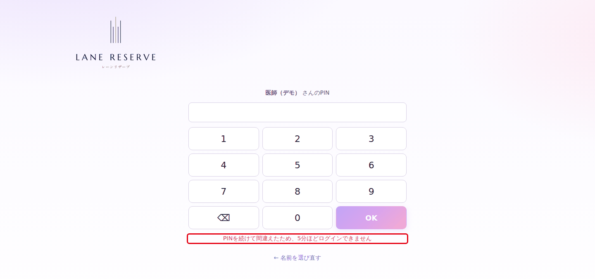
- デモ環境のPINは全員 `1234` です。本番では院長が設定画面で各スタッフのPINを決めます（新しく決めるPINは **6〜8桁の数字**）。

---

## 3. 画面の見方

### 3-1. 予約表（カレンダー）の全体

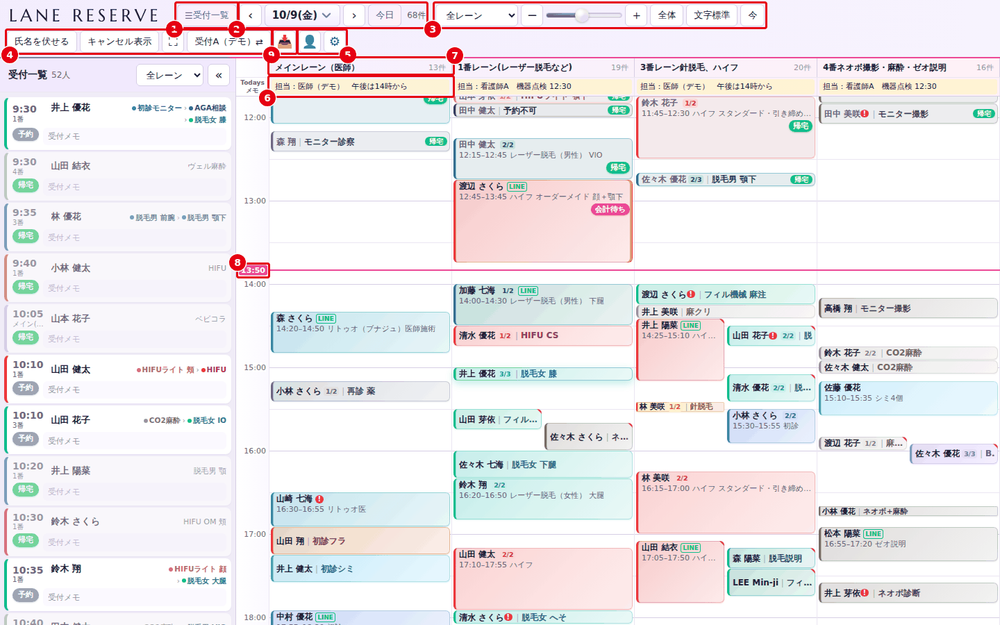

| 番号 | 名前 | 説明 |
| --- | --- | --- |
| ① | ☰ 受付一覧 | 左の受付一覧を開く・たたむ |
| ② | 日付の移動 | ‹ 前の日／日付（押すとカレンダー）／› 次の日／今日。右の「○件」はその日の予約数（キャンセルを除く） |
| ③ | 拡大・縮小 | −／スライダー／＋ で時間軸の高さを変える。「全体」で1日を画面に収める。「文字」で文字の大きさ（標準→大きめ→特大）。「今」は今日だけ表示され、現在時刻へ移動 |
| ④ | 表示の切り替え | レーンの絞り込み（全レーン／1レーンだけ）、氏名を伏せる、キャンセル表示、全画面（⛶）、ログイン中の名前（押すとスタッフ交代） |
| ⑤ | 👤 患者／⚙ 設定 | 患者の検索・編集画面、設定画面へ |
| ⑥ | Todaysメモ | レーンごとのその日のメモ（[3-4](#3-4-todaysメモ)） |
| ⑦ | レーン名 | 列の名前と、そのレーンの予約件数 |
| ⑧ | 現在時刻の線 | 今日を開いているときだけ、今の時刻に赤い横線と時刻が出ます |
| ⑨ | 📥 受付箱 | LINE予約申請の受付箱（[4-4](#4-4-line予約申請の文面から入れる)）。未対応の申請があると件数の赤い札が付きます |

- 縦軸が時刻、横にレーンが並びます。
- 画面の幅が広いとき（横1280px以上）は、上のバーの左端に **LANE RESERVE のロゴ** が出ます。狭い画面・スマホでは出ません。
- 今日を開くと、現在時刻の少し前まで自動で移動します。ほかの日は診療開始の時刻から表示します。
- パソコンでは **Ctrl＋マウスホイール**（トラックパッドのピンチ）、スマホ・タブレットでは **2本指のピンチ** でも拡大・縮小できます。
- 上のバーだけを切り出すと次のようになります。 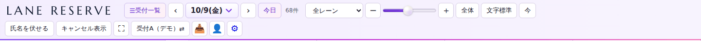
- 「全体」を押したところ。 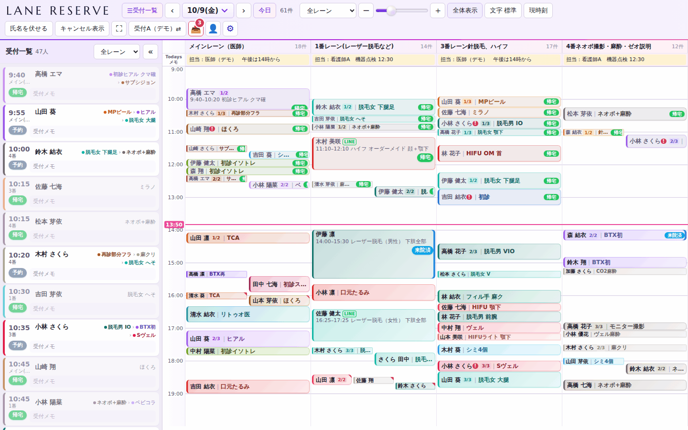

### 3-2. 予約枠の印

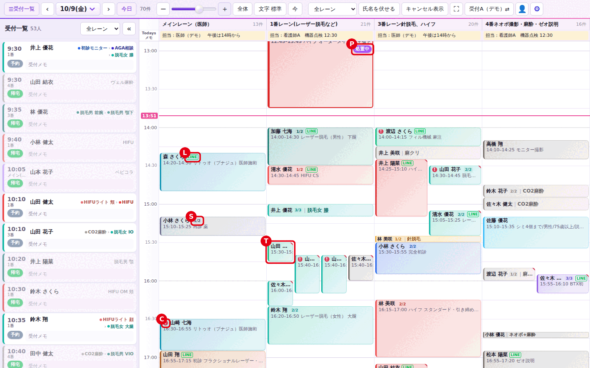

| 印 | 意味 |
| --- | --- |
| **C：赤い「!」** | 患者に **注意事項** がある（アレルギー・禁忌など）。必ず患者情報を確認してください |
| **L：LINE** | 患者のLINEが紐付いている |
| **S：1/2・2/3 など** | 同じ日に同じ患者の枠が複数あるとき、何番目の枠か（例：撮影→説明→施術） |
| **T：右上の赤い三角** | 同じレーンで時間が **重なっている** 予約がある。2人同時の施術でなければ、どちらかを動かしてください |
| **P：右端の色の札** | 今の **状態**（来院済・処置中・帰宅など）と、その状態にした時刻 |

- 枠の色はメニューの色です。キャンセル・無断キャンセルの枠は通常は表示されません。
- 枠に出す情報（名前・時刻・施術）は、設定 → 画面の表示・配色 で端末ごとに選べます。

### 3-3. 日付を選ぶ

日付のボタンを押すとカレンダーが開きます。日付の下の小さな数字はその日の予約数、赤い字は祝日です。「1週前／1週後／2週後／4週後」で次回予約の日へすぐ移れます。

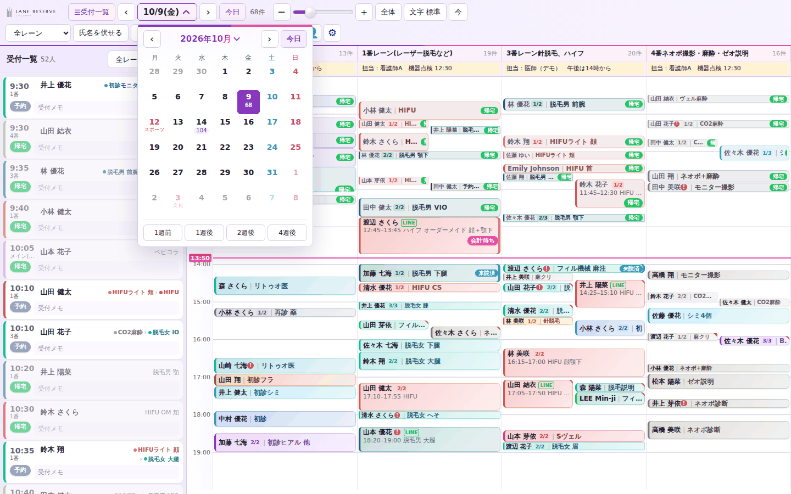

### 3-4. Todaysメモ

1. 予約表の一番上、レーンの下の欄（何も書いていないときは「＋」）を押します。
2. 担当スタッフ・今日の注意点などを書きます（最大1000文字）。
3. 枠の外を押すか **Ctrl＋Enter** で保存します。**Esc** で取り消し。

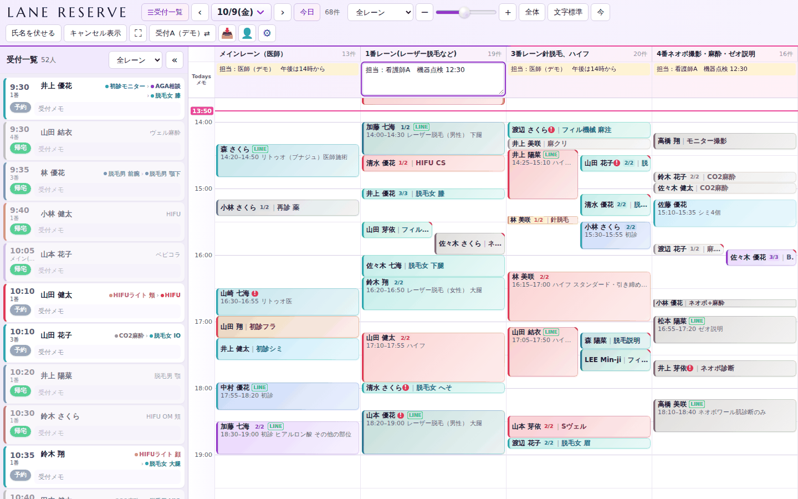

### 3-5. 受付一覧

左側の一覧には、その日の患者が時刻順に並びます（右上はレーンの絞り込み、「«」でたたむ）。パソコンでは最初から開き、スマホ・タブレットではたたまれています。

- 行を押すと、予約表のその予約が選ばれ、右に詳細が出ます。
- 行の左下の **状態の札（予約・帰宅など）** を押すと、状態を選ぶ窓が開き、その場で状態を変えられます（[6章](#6-来院から会計までの状態の付け方)）。
- 「受付メモ」を押すと、その日の受付メモを書けます。

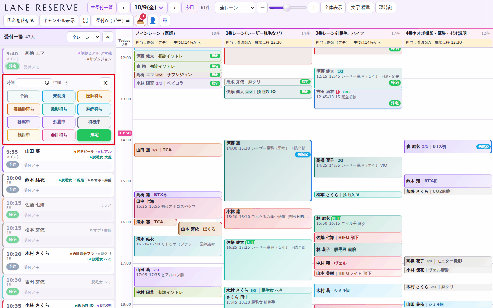

### 3-6. 氏名を伏せる

患者から画面が見える場所では **「氏名を伏せる」** を押します。姓の1文字以外が「＊」になり、詳細パネルの電話番号なども隠れます。もう一度押すと戻ります（この設定は端末ごと）。

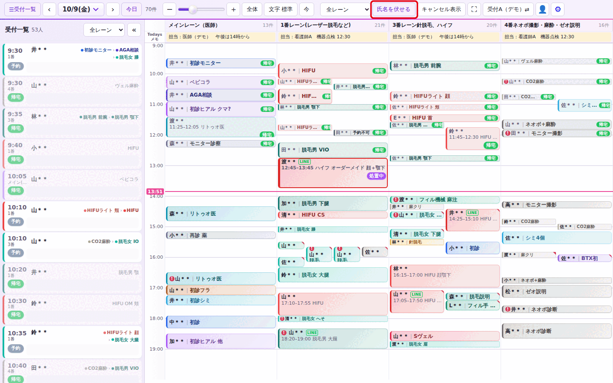

---

## 4. 予約を入れる

### 4-1. 基本の手順

1. 予約表で、入れたいレーン・時刻の **空いている所を押します**（①）。5分刻みで、押した時刻が開始になります。 ※右に詳細パネルが開いているときは、1回目の押しで詳細が閉じます。もう一度押してください。 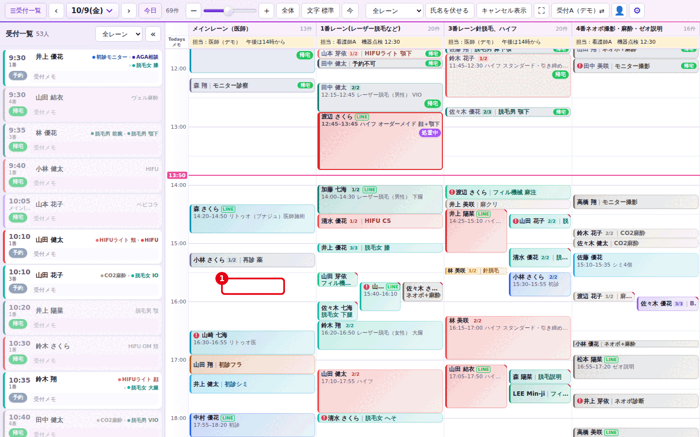
2. 「新しい予約」の画面が開きます。 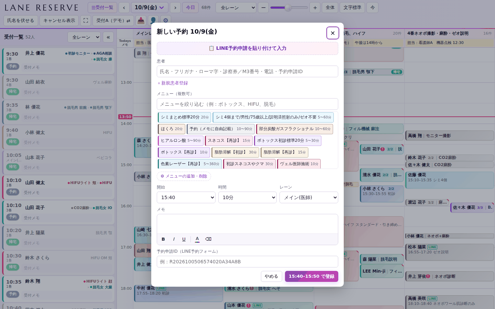
3. **患者** の欄に、氏名・フリガナ・ローマ字・診察券／M3番号・電話・予約申請ID のどれかを入れます（②）。候補が出たら押して選びます。 ひらがな／カタカナ、全角／半角、大文字／小文字、空白の違いは気にしなくて大丈夫です。 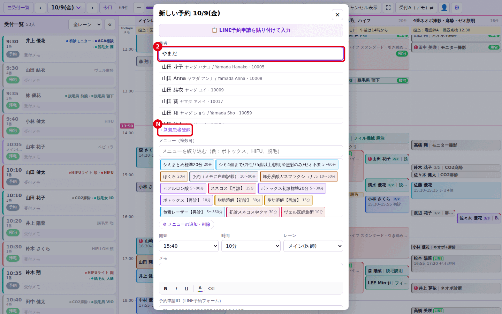
4. **メニュー** を選びます。上の欄（③）に「脱毛」「ボトックス」などを入れると絞り込めます。押すと追加され、**複数選べます**（× で外す）。 そのレーンで通常行わないメニューは、薄く・後ろに表示されます。 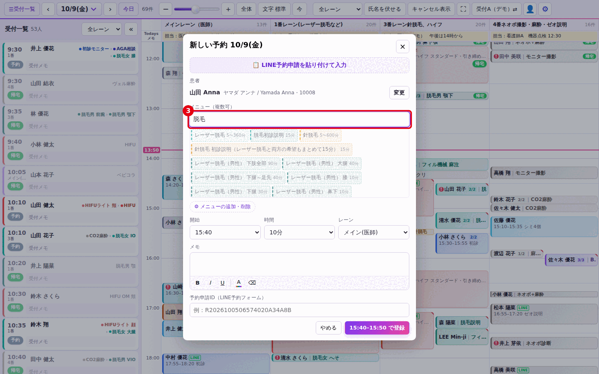
5. **開始・時間・レーン** を確かめます（④）。時間はメニューの初期値が自動で入ります（複数なら合計）。
6. 必要なら **メモ** と **予約申請ID（LINE予約フォーム）** を入れます。
7. 下の **「○:○○–○:○○ で登録」**（⑤）を押します。 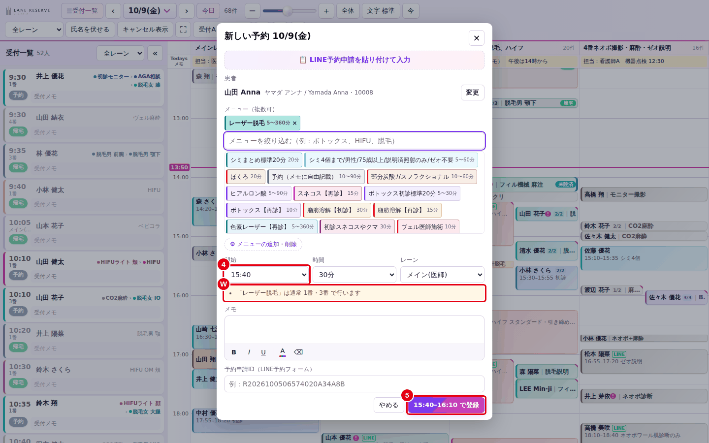
8. 「予約を登録しました」と出て、登録した予約が選ばれた状態になります。 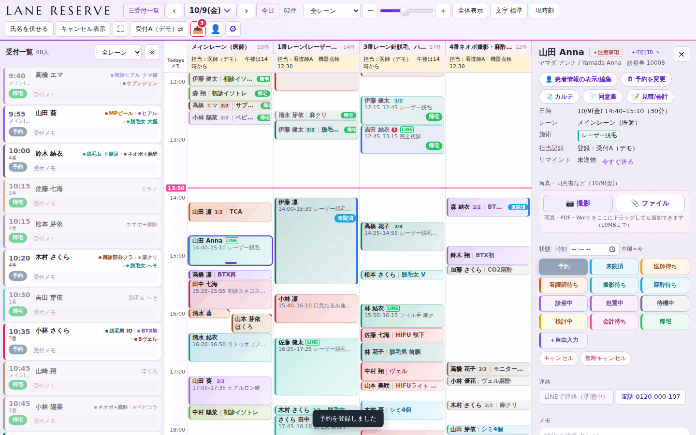

### 4-2. 出てくる警告

赤い枠（W）の警告が出ても登録はできます。内容を確かめてから登録してください。

- 「『○○』は通常 1番・3番 で行います」… そのレーンで通常行わないメニュー
- 「メニューの設定（10〜60分）の範囲外です」「メニューの設定は○分（固定）です」… メニューを1つだけ選んだとき、時間が設定と合わない

次のときは **登録できません**（赤字で理由が出ます）。

- 患者を選んでいない／メニューを選んでいない
- 診療時間を超えている
- 予約申請IDに英数字・ハイフン以外が入っている

同じレーン・同じ時間に別の予約があっても登録できます（右上に赤い三角が付きます）。

### 4-3. 新しい患者を登録しながら予約する

1. 患者の欄の下の **「＋新規患者登録」** を押します（検索欄の文字は氏名に入ります）。
2. 氏名（必須）・フリガナ・別の表記（ローマ字・旧姓など）・電話・生年月日・M3カルテ番号を入れます。氏名は **漢字・ひらがな・カタカナ・ローマ字を混ぜて** 入れられます（例：山田 Anna、LEE Min-ji）。
3. 診察券番号は自動で振られます。メニュー・時間を選んで登録すると、患者も同時に登録されます。
4. 既存の患者から選び直すときは「← 既存の患者から探す」。

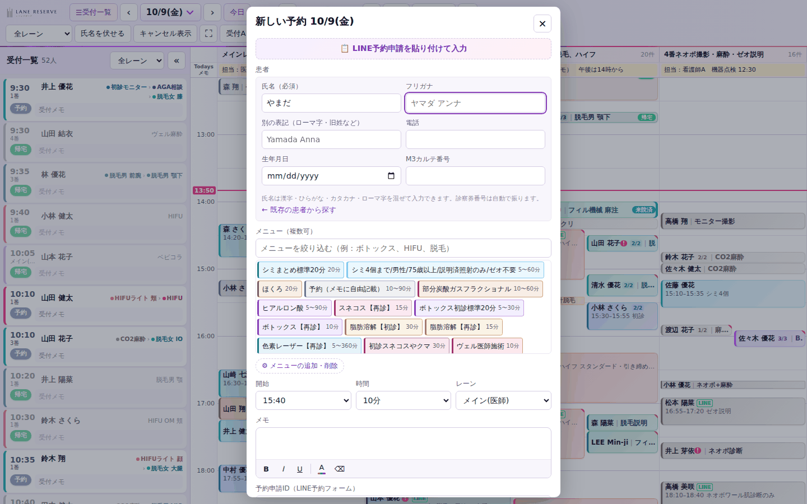

### 4-4. LINE予約申請の文面から入れる

1. 「📋 LINE予約申請を貼り付けて入力」を押します。
2. 申請の文面（「漢字氏名：…」「電話番号：…」「予約申請ID：…」の形）を貼り付け、「読み取って入力」を押します。
3. 同じ電話番号で氏名かフリガナも合う患者が1人いればその患者が選ばれます。いなければ新規患者の欄に入ります。希望日がこの日と違うときは知らせが出ます。
4. 内容を確かめて登録します。

**受付箱から入れる**：上のバーの **📥（受付箱）** を押すと、最近30日のLINE予約申請のうち希望日が今日以降のものが新しい順に並びます。

1. 申請の **「予約を作る」** を押すと、希望日の予約表に切り替わり、申請の文面を読み取った「新しい予約」の画面が開きます。
2. 内容を確かめて登録します。登録した申請は「予約済み」になります（Airリザーブから取り込んだ予約のメモに申請IDがある場合も「予約済み」）。
3. 電話などで対応した申請は **「済み」**、受けない申請は **「見送り」** にします。「未対応に戻す」で戻せます。「予約済み・済み・見送りも表示」で対応済みの申請も見られます。

**【未確認】** 実際の申請文面での読み取りは、デモでは試していません。受付箱は **本番（PHP版）だけで動く機能** で、写真を撮った開発版では「この版では使えません」と出るため、申請の一覧は撮影できていません。

### 4-5. メニューがないとき

院長・管理者・受付は、メニュー一覧の下の「⚙ メニューの追加・削除」から、その場でメニューを作れます。作ったメニューはこの予約に入ります。

---

## 5. 予約を動かす・長さを変える

### 5-1. ドラッグで動かす（時間・レーン）

1. 予約枠を押したまま、動かしたい時刻・レーンへずらします（5分刻み）。点線の枠が移動先です。 スマホ・タブレットでは **長押し** してから動かします（選択中の予約はすぐ動かせます）。 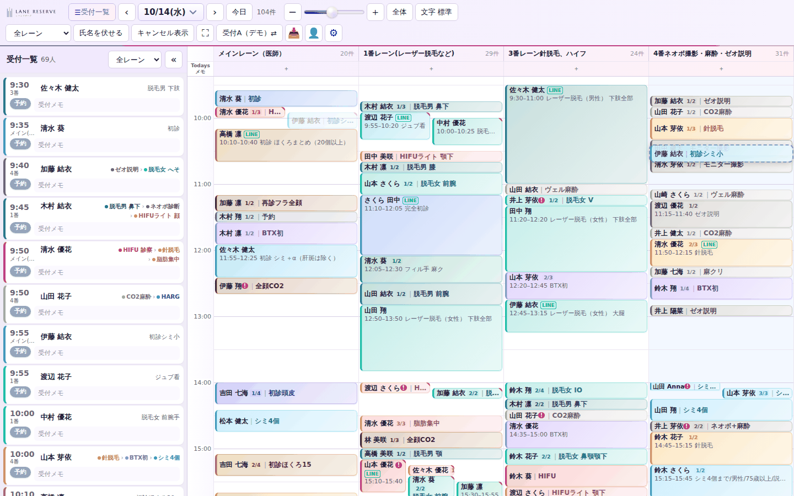
2. 指（マウス）を離すと **「予約時間を移動してよろしいですか？」** と出ます。変更前→変更後の時間・レーンを確かめます。
3. **はい** で保存、**キャンセル** で元に戻ります。 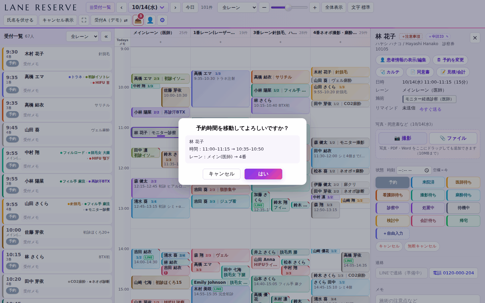

### 5-2. 長さを変える

1. 予約枠を押して選びます。
2. 枠の下端に出る **つまみ**（①）を上下にドラッグします（5分刻み）。 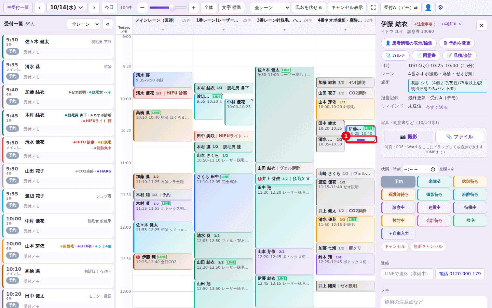
3. 同じように確認が出るので **はい** を押します。 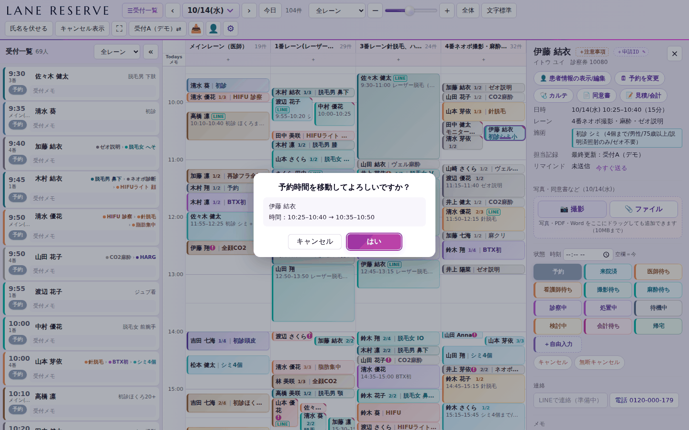

### 5-3. 別の日へ移す・メニューを変える（予約を変更）

ドラッグでは同じ日の中しか動かせません。別の日にする・メニューを変えるときは、詳細パネルの **「🗓 予約を変更」** を使います。

1. 予約を押して右の詳細を開き、「🗓 予約を変更」を押します。
2. 日付・開始・時間・レーンを選びます。「1週前／1週後／2週後／4週後」で日付をすぐ変えられます。
3. メニューは × で外し、下の一覧から追加します。
4. 下の「→ …」に変更後の内容が出るので確かめ、**変更する** を押します。別の日に移したときは、その日の予約表に切り替わります。

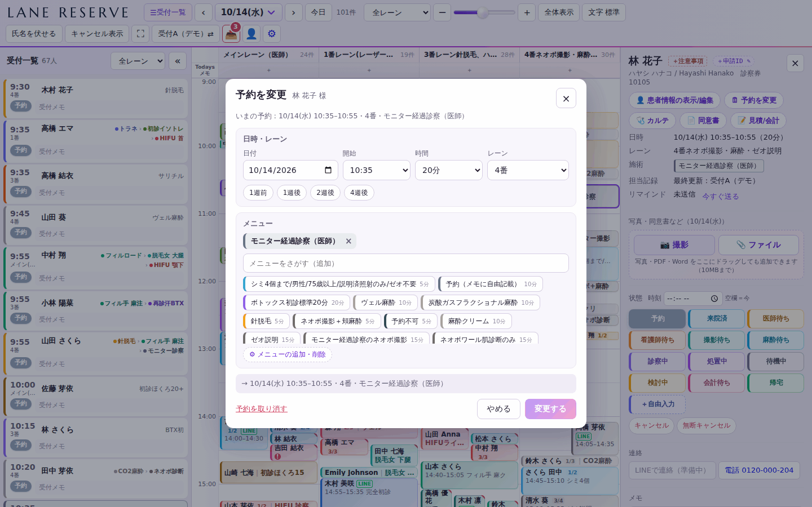

---

## 6. 来院から会計までの状態の付け方

### 6-1. 予約の詳細パネル

予約枠を押すと、パソコンでは右に、スマホでは下から **詳細** が出ます。

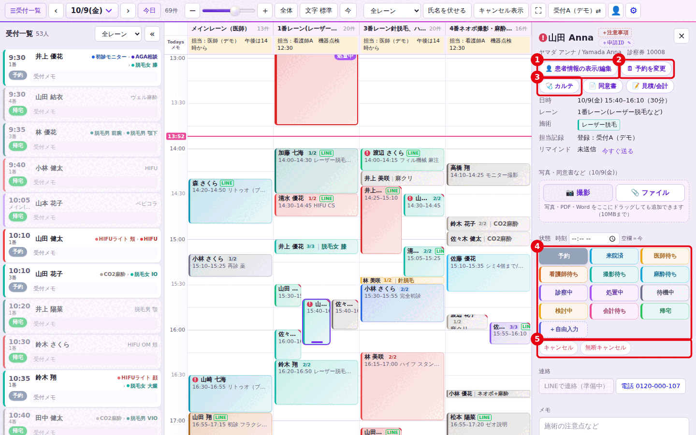

| 番号 | できること |
| --- | --- |
| ① | 👤 患者情報の表示/編集（患者画面を重ねて開く） |
| ② | 🗓 予約を変更（[5-3](#5-3-別の日へ移すメニューを変える予約を変更)） |
| ③ | 🩺 カルテ・📄 同意書・📝 見積/会計（[10章](#10-カルテ同意書見積)） |
| ④ | 状態のボタン |
| ⑤ | キャンセル／無断キャンセル（[7章](#7-キャンセル)） |

ほかに、日時・レーン・施術・担当記録（登録した人・最後に変えた人）・リマインドの状態、その日の写真・ファイル（📷 撮影／📎 ファイル）、連絡（電話番号を押すと電話をかけられる端末ではそのまま発信）、予約メモがあります。名前の横の「＋注意事項」で注意事項をその場で書き足せます。

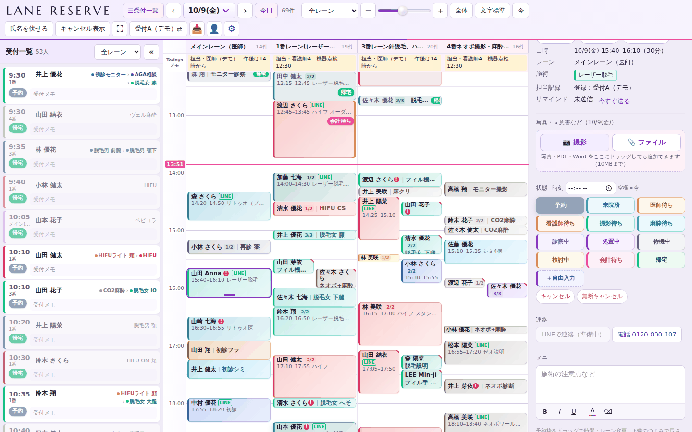

### 6-2. 状態を付ける

初期の流れの例：**予約 → 来院済 → （医師待ち・看護師待ち・撮影待ち・麻酔待ち・待機中・検討中）→ 診察中／処置中 → 会計待ち → 帰宅**

1. 患者が来たら、詳細パネルの **「来院済」** を押します。押したボタンが色付きになり、押した時刻が付きます。予約枠の右端にも札が出ます。 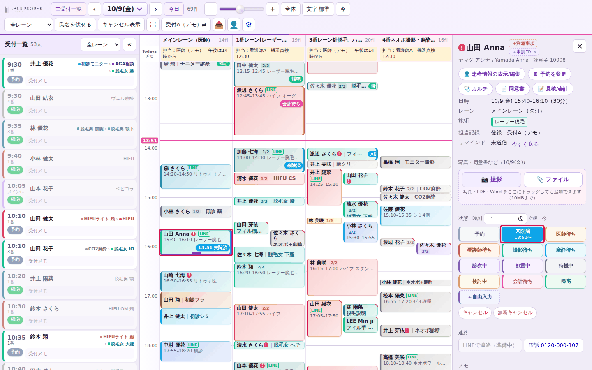
2. 待ち・診察・処置・会計待ちと進むたびに、そのボタンを押します。
3. 会計が終わって帰ったら **「帰宅」** を押します。

ポイント：

- **同じ日に同じ患者の枠が複数あるときは、全部の枠の状態がそろって変わります**（キャンセル系は押した枠だけ）。
- 押し忘れたときは、「時刻」欄に実際の時刻を入れてから状態のボタンを押すと、その時刻で記録されます。状態はそのままで時刻だけ直すときは、時刻を入れて **「時刻だけ直す」** を押します（空欄なら押した時刻）。
- 左の受付一覧の状態の札からも同じように変えられます（[3-5](#3-5-受付一覧)）。
- 状態の名前・色・数は院で変えられます（[13章](#13-設定院長管理者向け)）。

### 6-3. 自由入力（ひとこと）

「＋自由入力」を押すと、状態とは別に短い一言（20文字まで。例：15時までに出たい）を付けられます。「決定」で保存、「消す」で消します。予約枠にも札で表示されます。

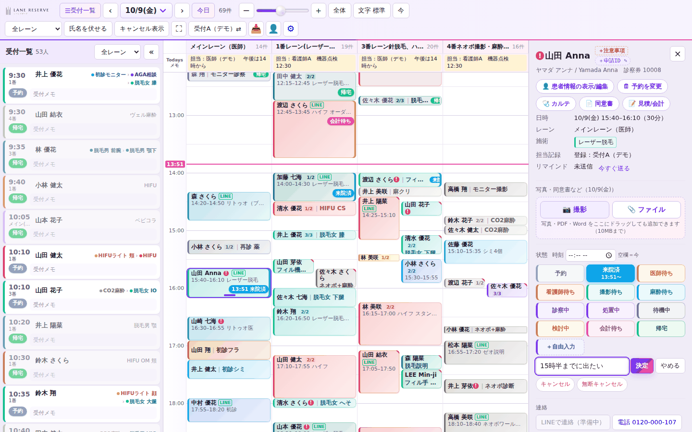

---

## 7. キャンセル

### 7-1. キャンセル・無断キャンセルにする

1. 予約枠を押して詳細を開きます。
2. 下の **「キャンセル」** または **「無断キャンセル」** を押します。
3. 「○○さんの予約をキャンセルにします。よろしいですか？」と出ます。**はい**（①）で確定、**いいえ**（②）でやめます。誤タッチ防止のため、必ずこの確認が出ます。 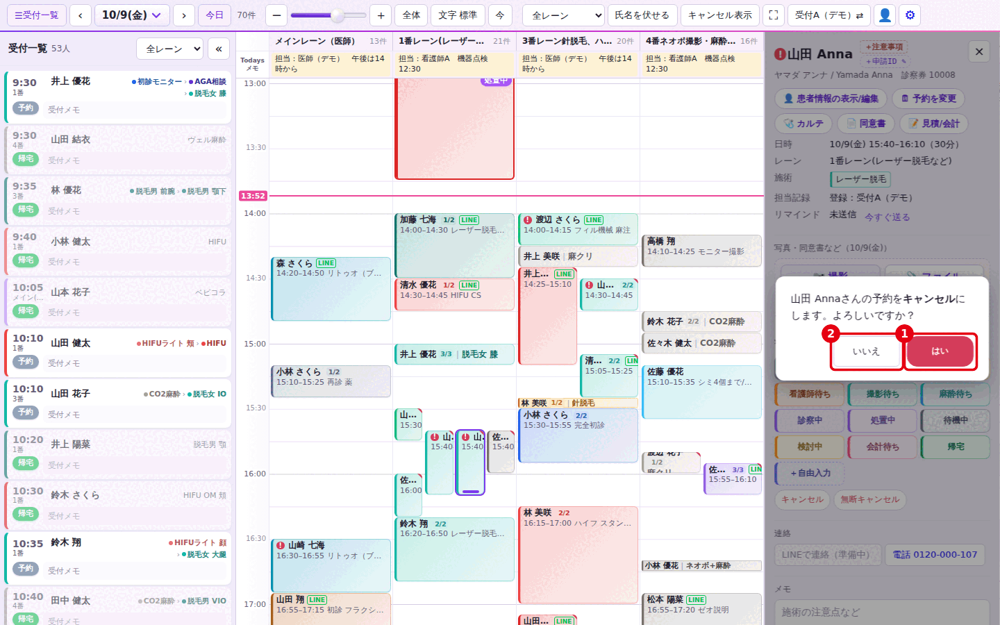
4. 確定すると、予約表から枠が消えます（詳細にはキャンセルの札が付きます）。 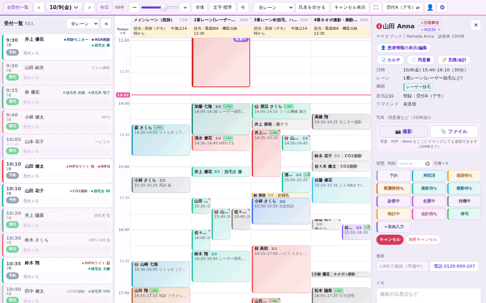

管理操作のできる人は、「🗓 予約を変更」の画面の左下 **「予約を取り消す」→「はい、取り消す」** でも取り消せます。

### 7-2. キャンセルした予約を見る

上のバーの **「キャンセル表示」** を押すと、取り消した予約が斜線入りで薄く表示されます。

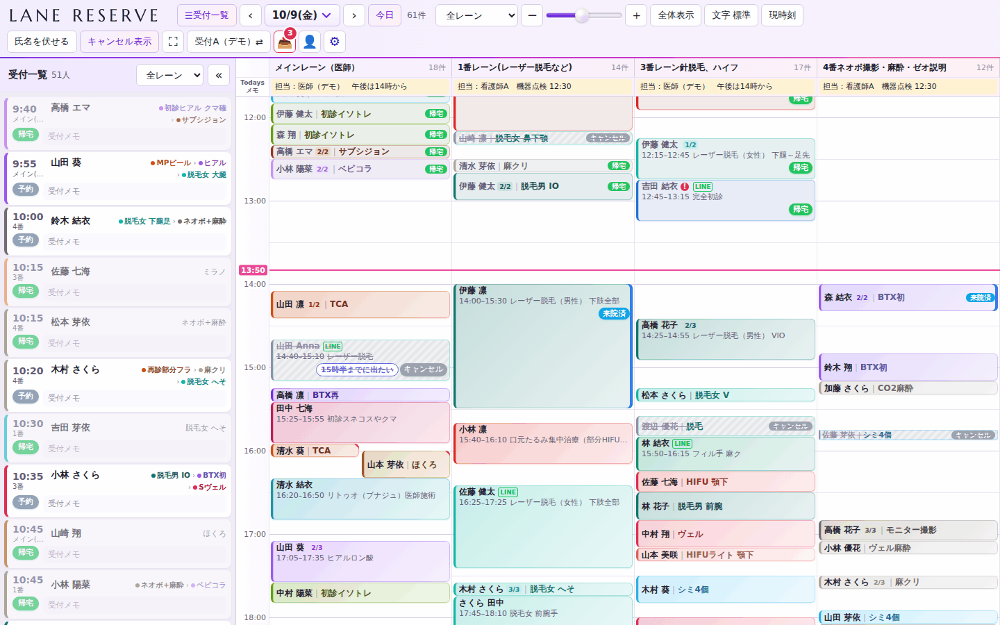

### 7-3. 取り消した予約を「予約」に戻す

間違えてキャンセル・無断キャンセルにしたときは、入れ直さずに元へ戻せます。

1. 上のバーの **「キャンセル表示」** を押して、取り消した予約を表示します。
2. 取り消した予約の枠（①）を押すと、右に詳細が開きます。上に「この予約はキャンセルになっています。」と出ます（取り消した予約はドラッグでは動かせません）。
3. **「予約に戻す」**（②）を押します。 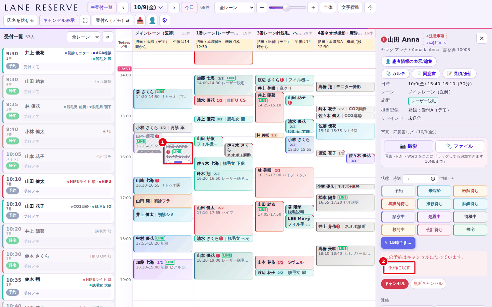
4. 「この予約を『予約』に戻します。よろしいですか？」とブラウザの確認が出るので、**OK**（①）を押します。やめるときは **キャンセル**（②）。ボタンの見た目と名前はブラウザによって少し違います（この写真だけ、ブラウザの枠ごと撮っています）。 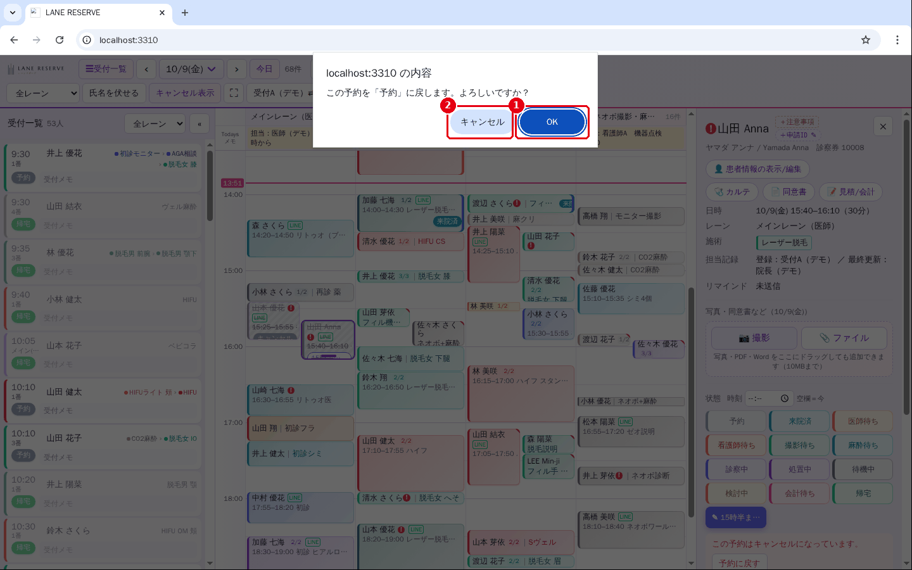
5. 予約は「予約」の状態に戻り、予約表に普通の枠で表示されます。同じ時間に別の予約が入っていれば、右上に赤い三角が付きます。

---

## 8. 患者を探す・登録する・編集する

### 8-1. 患者を探す

1. 予約表の右上の **👤** を押します。
2. 検索欄（①）に、氏名・フリガナ・ローマ字・診察券／M3番号・電話・予約申請ID のどれかを入れます。何も入れていないときは「最近登録・更新した患者」が出ます。 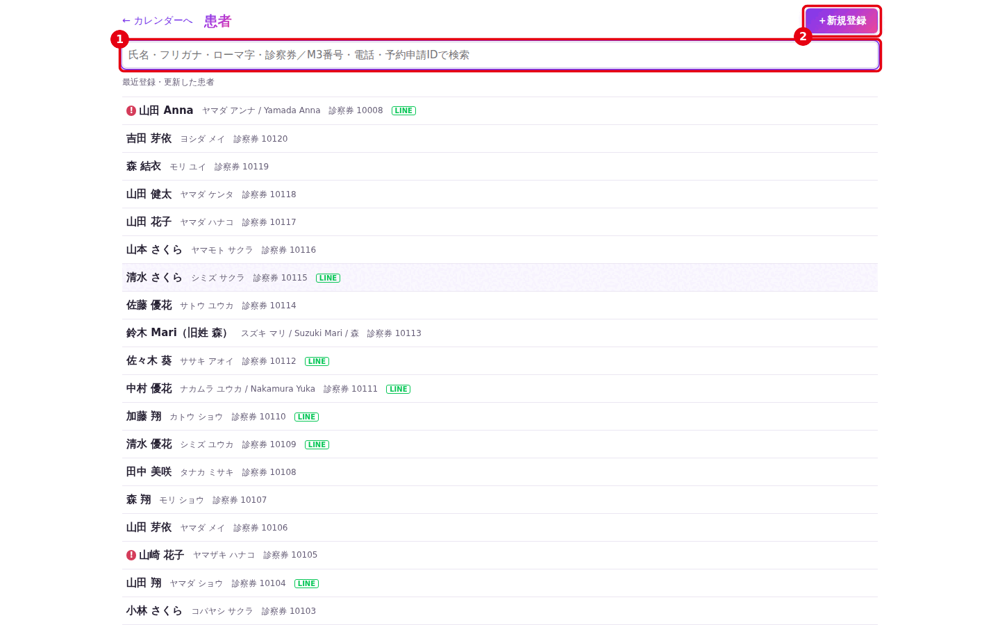
3. 半角カナでもひらがなでも探せます（例：「ﾔﾏﾀﾞ」で山田さんが出ます）。名前を押すと患者画面が開きます。 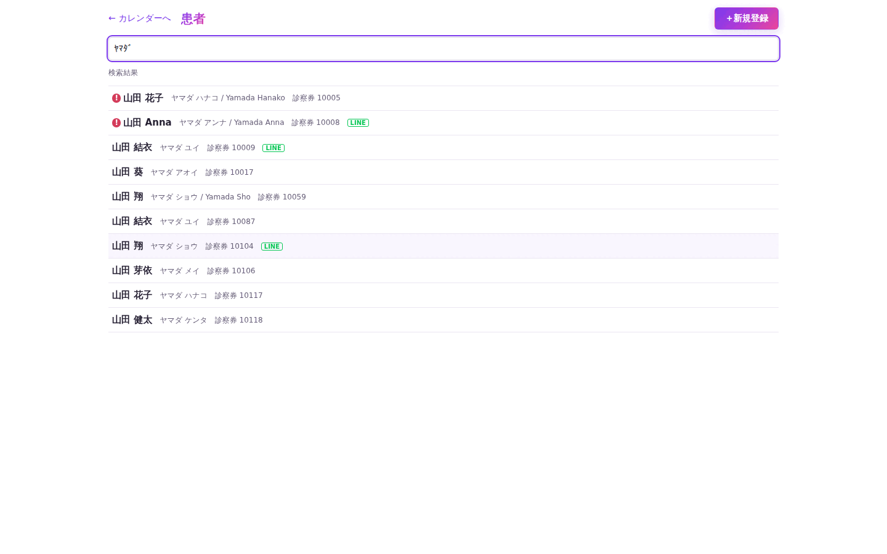

予約の詳細の「👤 患者情報の表示/編集」からも、同じ患者画面を開けます。

### 8-2. 患者を登録する（予約なしで）

1. 患者一覧の **「＋新規登録」**（②）を押します。
2. 氏名（必須）・フリガナ・生年月日・電話番号を入れて **「登録する」** を押すと、その患者の画面が開きます。住所・注意事項などはそこで入れます。

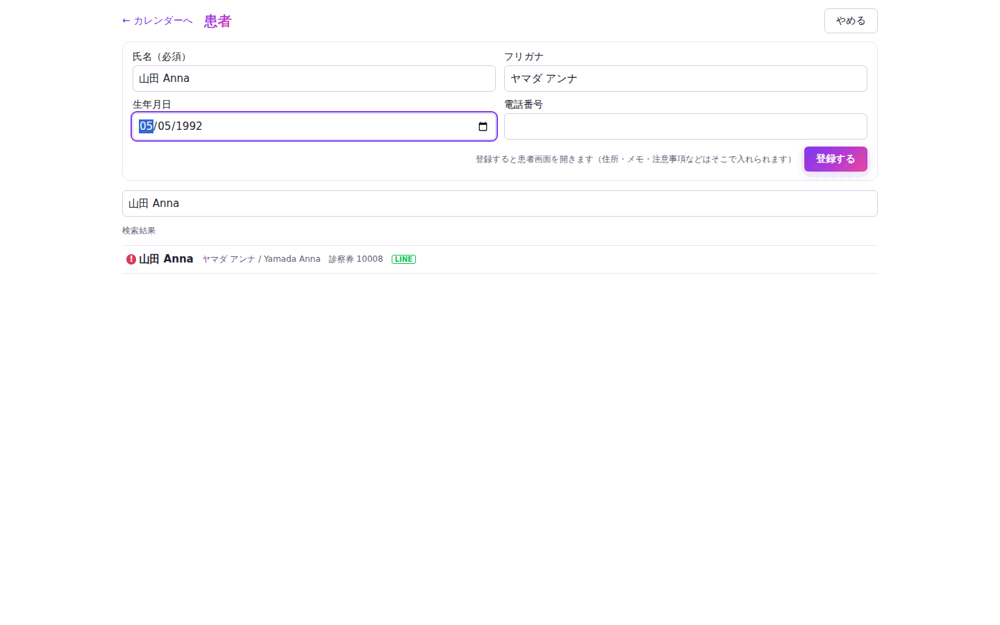

### 8-3. 患者画面の見方

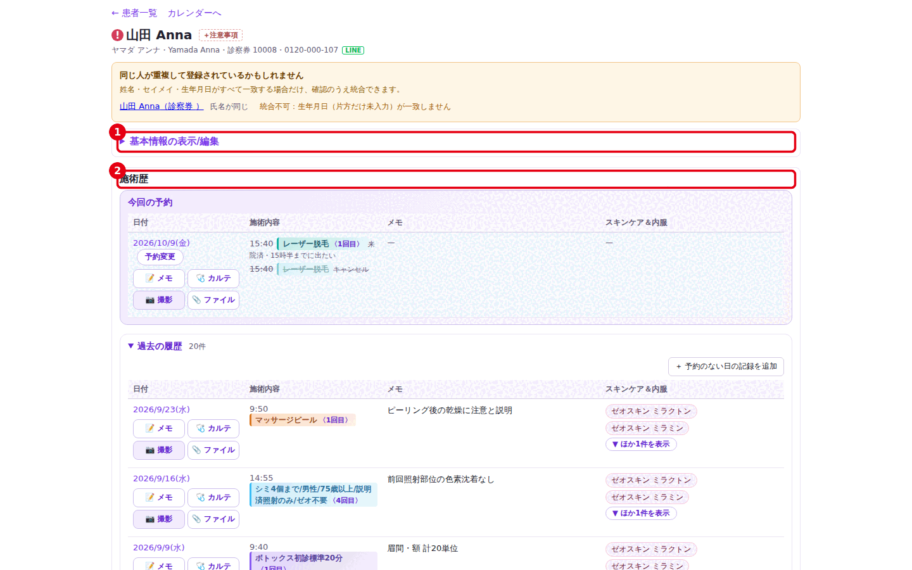

上から順に：

1. 名前・フリガナ・年齢・診察券番号・電話・LINEの印。名前の横の「＋注意事項」で注意事項を書き足せます。
2. 重複や削除のお知らせ（あるときだけ）
3. **基本情報の表示/編集**（①、押すと開く）
4. **施術歴**（②）：今回の予約／過去の履歴／今後の予約
5. 同意書・見積・会計の控え
6. その他の操作（写真比較・重複している患者をまとめる・この患者を削除）
7. 変更履歴

### 8-4. 基本情報を直す

1. 「基本情報の表示/編集」を押して開きます。
2. 氏名・フリガナ・別の表記・診察券番号・M3カルテ番号・生年月日（年齢が自動で出ます）・性別を直します。**変えた欄は色が付きます**（①）。
3. **連絡先情報**（②）は、押すと開きます（電話・メール・リマインドの送り先・リマインド不要・郵便番号・住所）。閉じているときも、見出しの横に電話番号と「住所あり」が出ます。 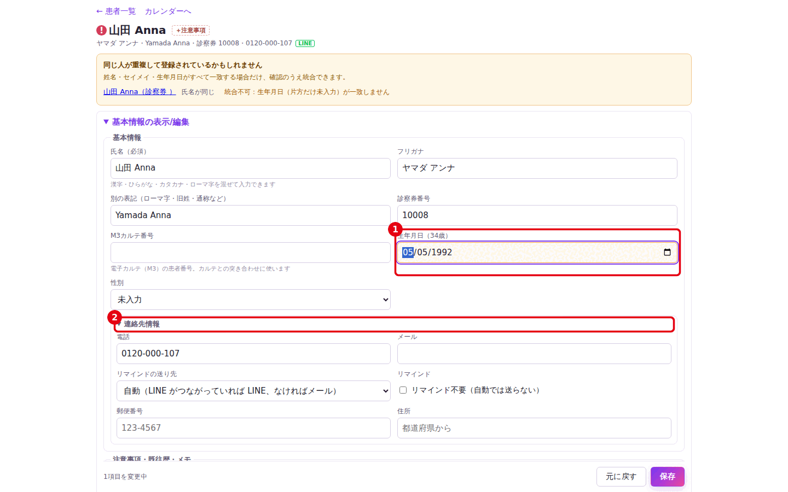
4. 下へ進むと **注意事項・既往歴・メモ** があります。
   - 「注意事項あり」にチェックすると、予約表に「!」が出ます。
   - 重要事項（アルコール綿禁止・薬疹・アレルギー・禁忌など）はカルテの上に目立つように出ます。
   - 既往歴・内服歴・**その他の問診票情報**（問診票が届くたびに日付付きで足されます）・院内メモ。
   - 問診票の回答があれば、最新の既往歴・内服歴・アレルギーが表示され、「この問診票の回答をすべて見る」で全部の回答を見られます（[9章](#9-問診票)）。 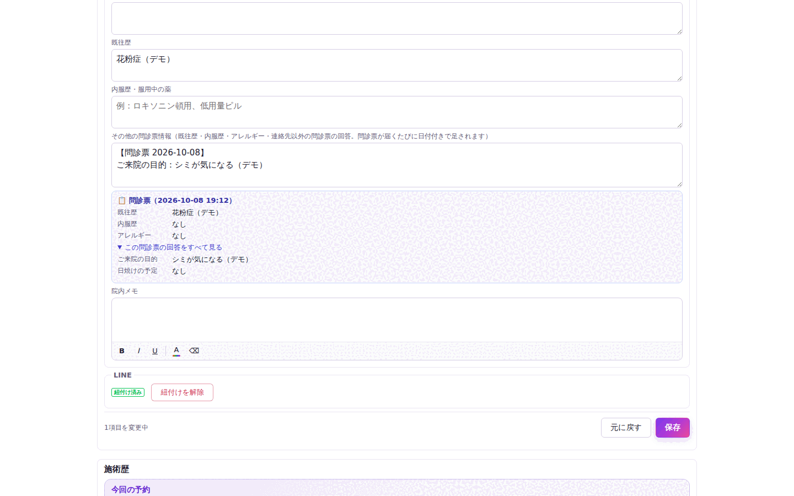
5. 一番下の「○項目を変更中」を確かめ、**保存**（③）を押します。やめるときは「元に戻す」。 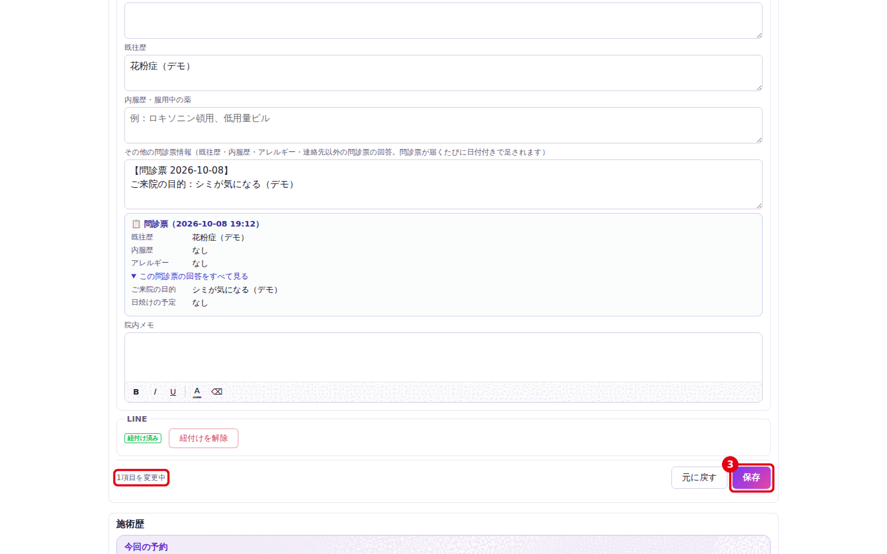

LINE欄の「紐付けを解除」で、LINEの紐付けを外せます（確認が出ます）。

### 8-5. 施術歴（簡易カルテ）・今後の予約

- **今回の予約**：今日の予約（なければ次回の予約日）。
- **過去の履歴**：日付ごとに、施術内容（〈○回目〉付き）・メモ・スキンケア＆内服が並びます。各行の「📝 メモ」「🩺 カルテ」「📷 撮影」「📎 ファイル」で記録を足せます。「＋ 予約のない日の記録を追加」で、予約のない日の記録も作れます。たくさんあるときは「さらに表示」。
- **今後の予約**：日付・時間・メニュー・レーン・状態・予約メモ。「変更」でその予約を直せます。 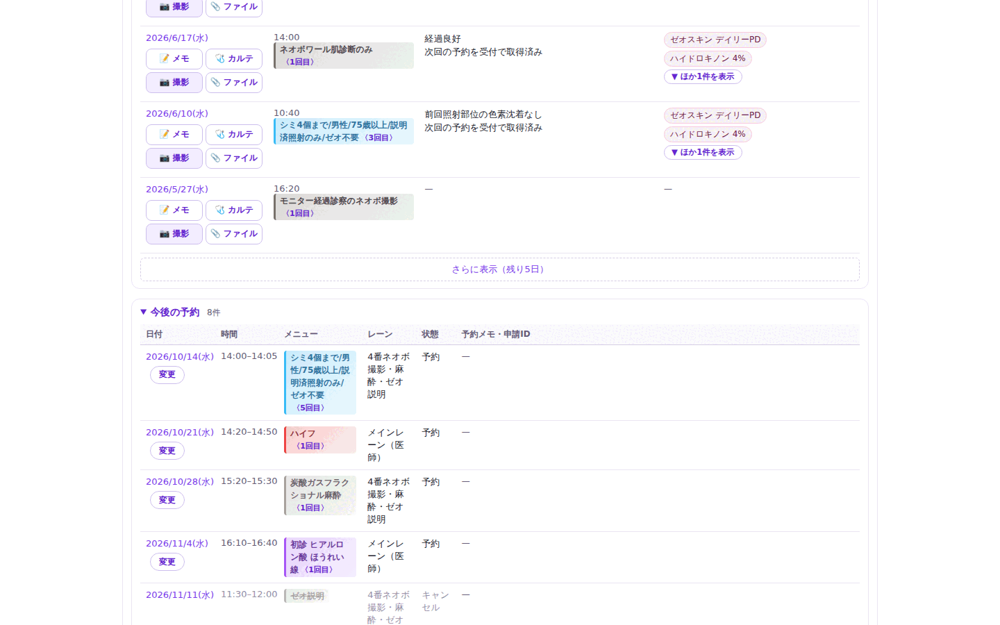

### 8-6. 変更履歴

画面の一番下に、「いつ・だれが・どの項目を」変えたかが出ます（値そのものは残しません）。問診票から自動で入った分は「問診票（自動取り込み）」と出ます。

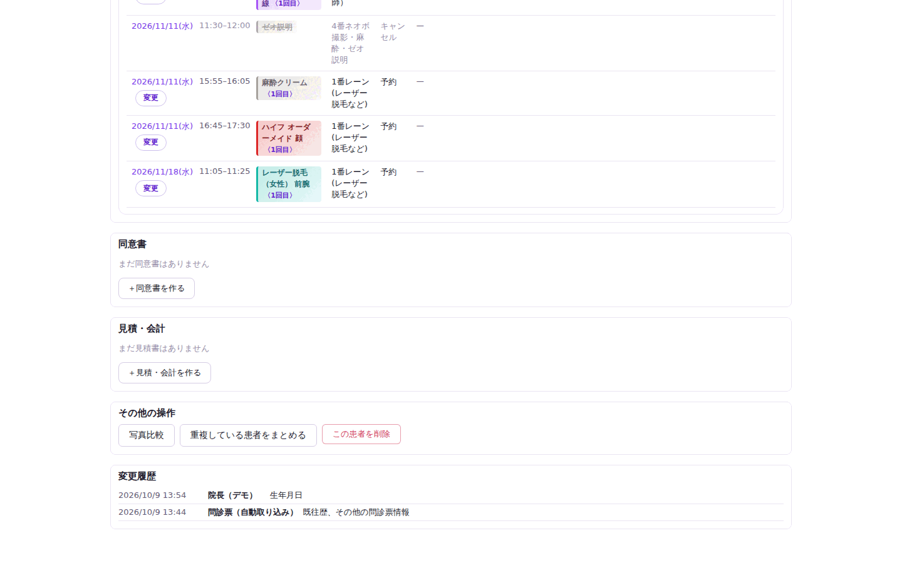

### 8-7. 重複している患者をまとめる（統合）

**氏名・フリガナ・電話番号・M3カルテ番号のどれか** が同じ患者がいると、患者画面の上に **「同じ人が重複して登録されているかもしれません」** と出ます（お知らせが出るだけで、まだ統合はされません）。実際に統合できるのは、**姓名・フリガナ（セイメイ）・生年月日がすべて一致する場合だけ** です（院長・管理者と受付）。生年月日が両方とも未入力なら、姓名とフリガナが一致すれば統合できます。どれかが食い違うときは「統合不可」と理由が出ます。

1. 「確認して統合」（または「その他の操作」→「重複している患者をまとめる」で相手を探す）を押します。 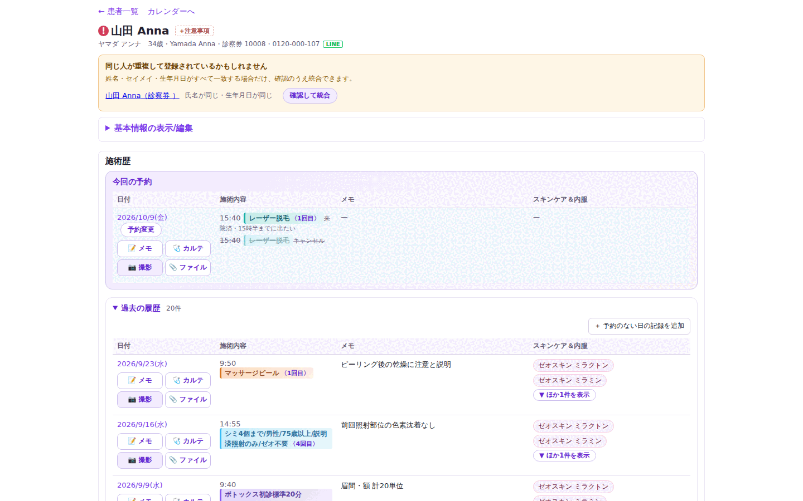
2. **残す方** を選びます。もう一方の予約・施術歴・記録は残す方へ移り、空欄は補われ、注意事項・院内メモはつなげられます。
3. 内容を確かめて **統合する** を押します。 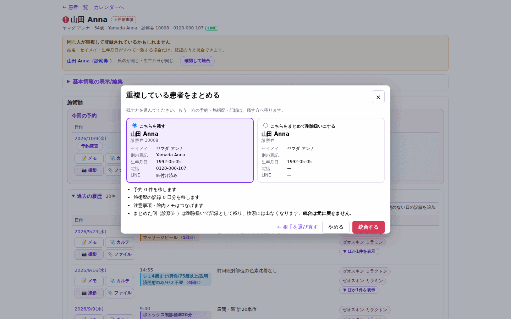
4. 残した方に「統合しました」と出ます。 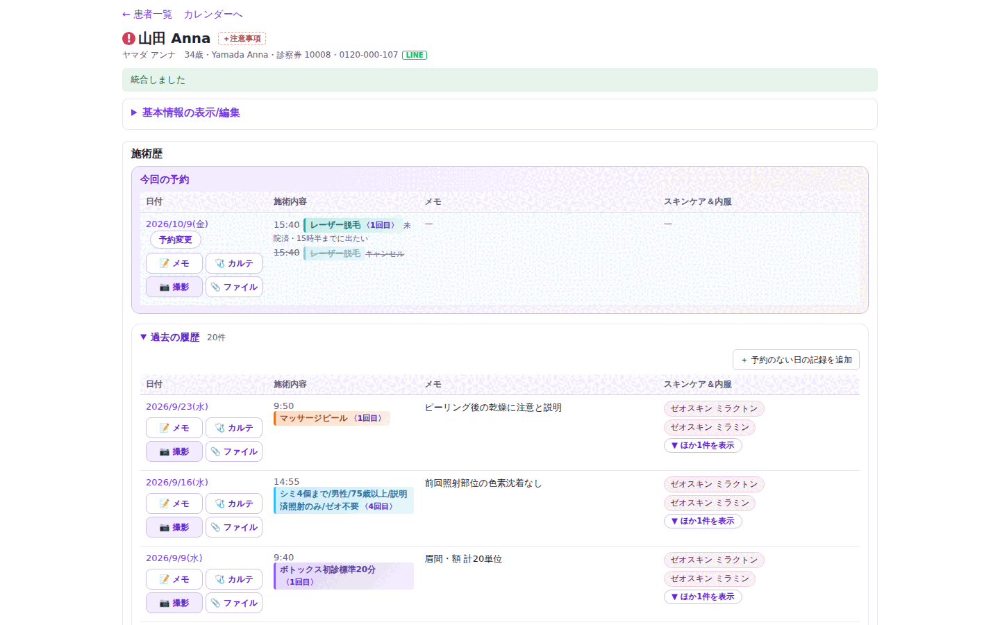
5. まとめた側は削除扱いで残り、「統合先の患者を開く」リンクと **「統合を取り消す」** ボタンが出ます。 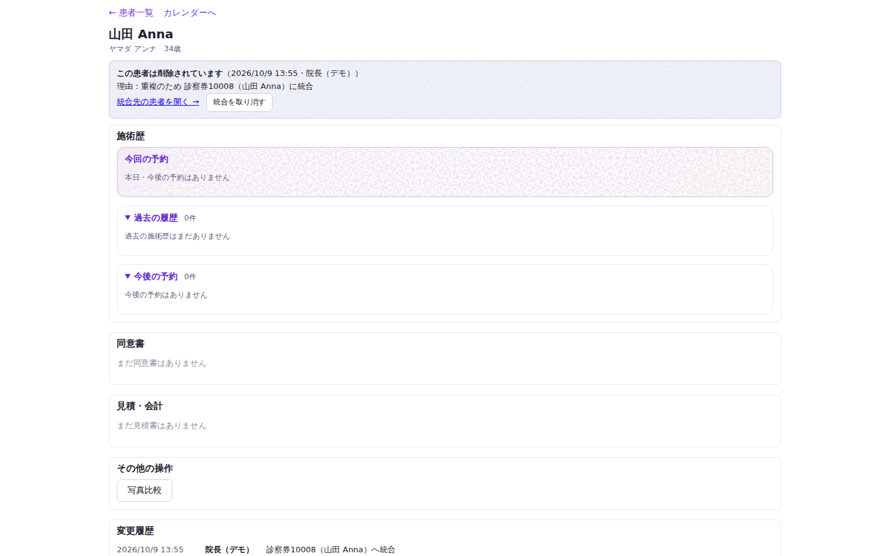

### 8-8. 患者を削除する・元に戻す

診療の記録は残す必要があるため、本当には消さず「削除済み」にします（院長・管理者と受付）。**今日以降の予約がある患者は削除できません。**

1. 患者画面の「その他の操作」→ **「この患者を削除」** を押します。
2. 理由（誤って登録した／重複して登録した／本人の希望／その他）を選び、**削除する** を押します。 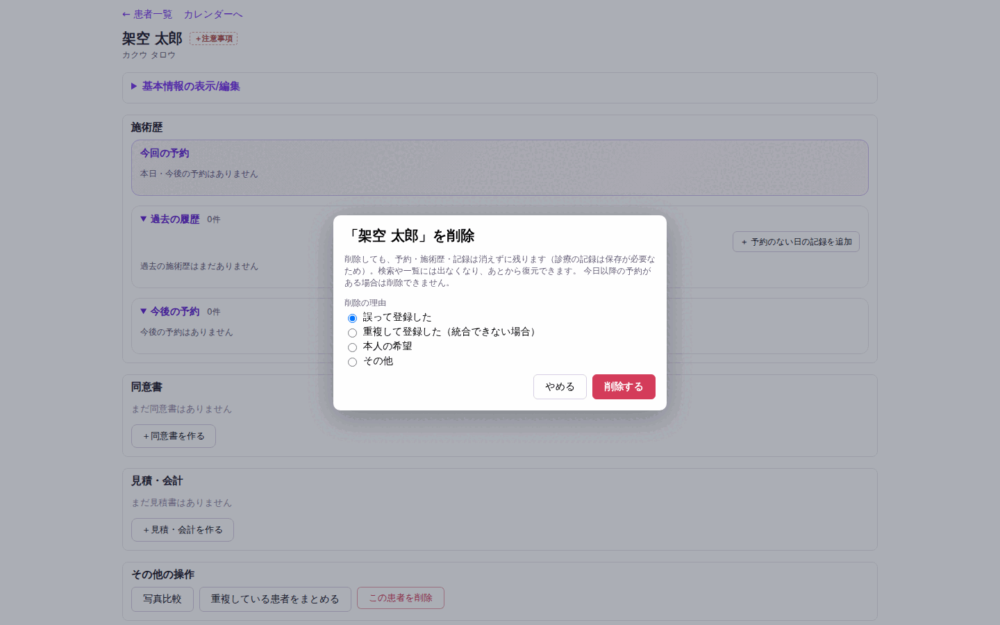
3. 削除した患者は検索・一覧に出なくなります。画面の上に「この患者は削除されています」と出て、**「削除を取り消して復元する」**（①）で元に戻せます。 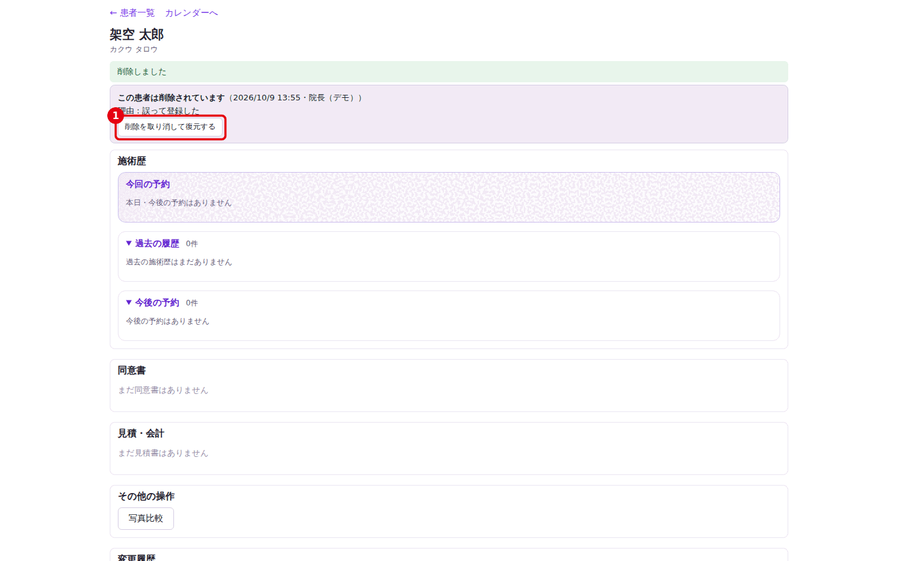

### 8-9. ほかの人が同時に同じ患者を直したとき

2台で同じ患者を直し、先にほかの端末が保存していると、後から保存した側に **「他の端末でこの患者の情報が先に更新されました。最新の内容を読み込む（入力中の変更は消えます）」** と出て、上書きされません。入力した内容を控えてから「最新の内容を読み込む」を押し、もう一度直してください。

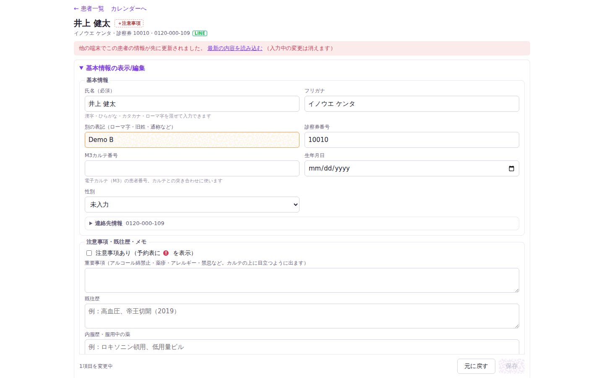

---

## 9. 問診票

Googleフォームの問診票の回答は、自動でこのアプリに送られます（院で送る仕組みの設置が必要です）。

### 9-1. 回答が患者に結びつく決まり

- **氏名（またはフリガナ）＋生年月日か電話番号** が合う患者が1人いれば、自動で結びつきます。
- 結びついた回答は、患者画面の「注意事項・既往歴・メモ」（[8-4](#8-4-基本情報を直す)）と、カルテの「既往歴・内服歴」で見られます。電話・住所・既往歴などの空いている欄にも写され、変更履歴に「問診票（自動取り込み）」と残ります。

### 9-2. 結びつかなかった回答を結びつける

合う患者がいない・2人以上いる回答は、設定 → **問診票** に一覧で出ます。

1. 予約表の ⚙ → 「問診票」タブを開きます。
2. 回答日時・氏名・生年月日・電話を見て、どの患者かを確かめます。
3. 「診察券番号で結びつける」の欄に **診察券番号**（①）を入れ、**結びつける**（②）を押します。
4. いたずらなどで不要な回答は「削除」（管理操作のできる人）。

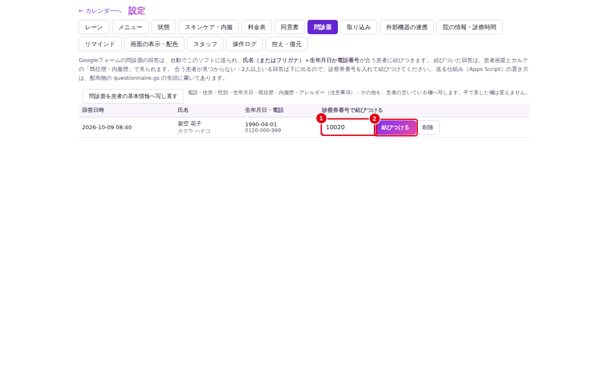

院長・管理者は「問診票を患者の基本情報へ写し直す」で、結びついている問診票の内容を患者の空いている欄へまとめて写し直せます（手で直した欄は変えません。先に控えを取ります）。

---

## 10. カルテ・同意書・見積

どれも、予約の詳細パネルのボタン、または患者画面から開きます。

### 10-1. カルテ（施術の記録）

1. 詳細パネルの **🩺 カルテ** を押します。
2. 施術名（予約のメニューが入っています）、＋部位・＋条件・＋薬剤・＋麻酔、所見・経過、次回の予定、施術者を入れます。
3. **保存** を押します。上の「重要事項…を書く」で注意事項を、「既往歴・内服歴」で問診票の内容を確認できます。下でその日の写真・ファイルも追加できます。

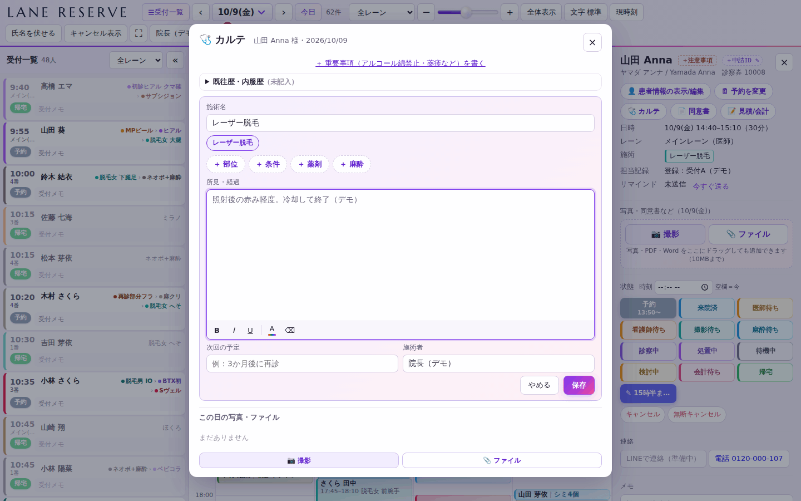

### 10-2. 同意書

1. 詳細パネルの **📄 同意書** を押します。その予約のメニューに結びついた同意書が先頭に出ます。上の欄で探すこともできます。 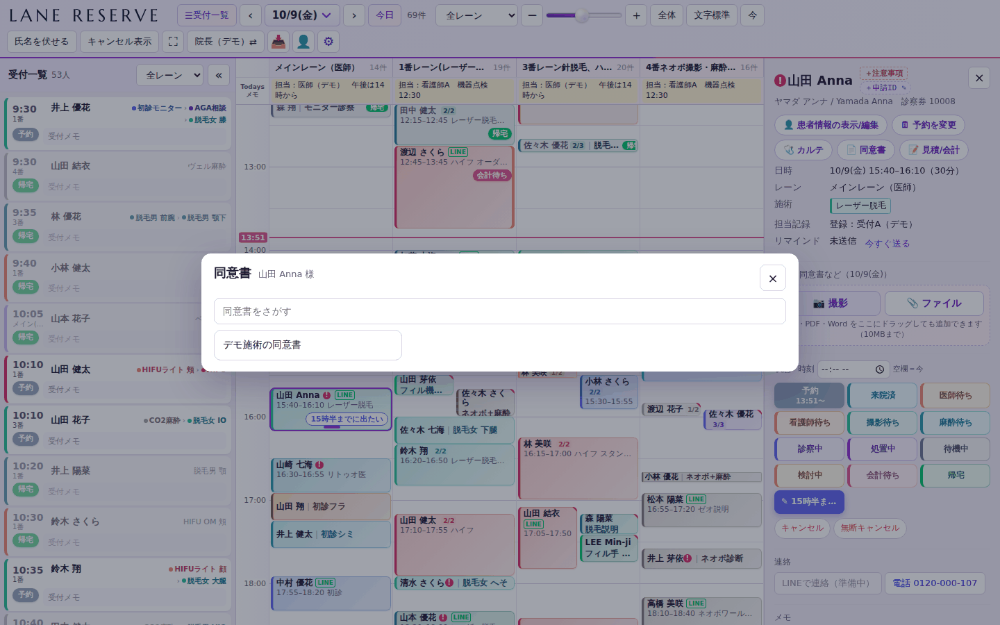
2. 同意書を押すと、患者名と日付が入った本文が出ます。「施術」の欄も確かめます。 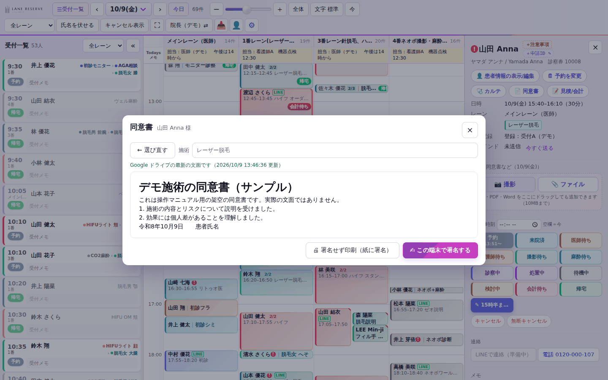
3. どちらかを選びます。
   - **✍ この端末で署名する**：枠の中に指またはペンで署名してもらい、**署名して保存**（「書き直す」でやり直し）。 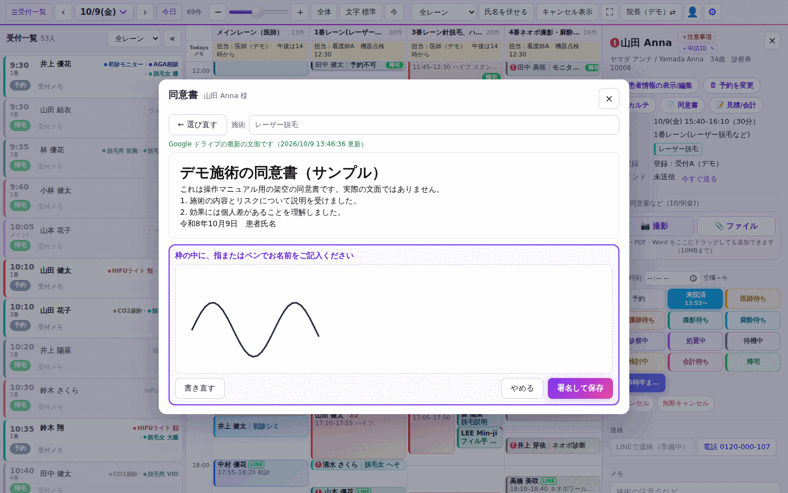
   - **🖨 署名せず印刷（紙に署名）**：紙に印刷して署名してもらう。
4. 保存すると控えが患者画面の「同意書」に残ります。**🖨 印刷・PDF** で印刷・PDFにできます。 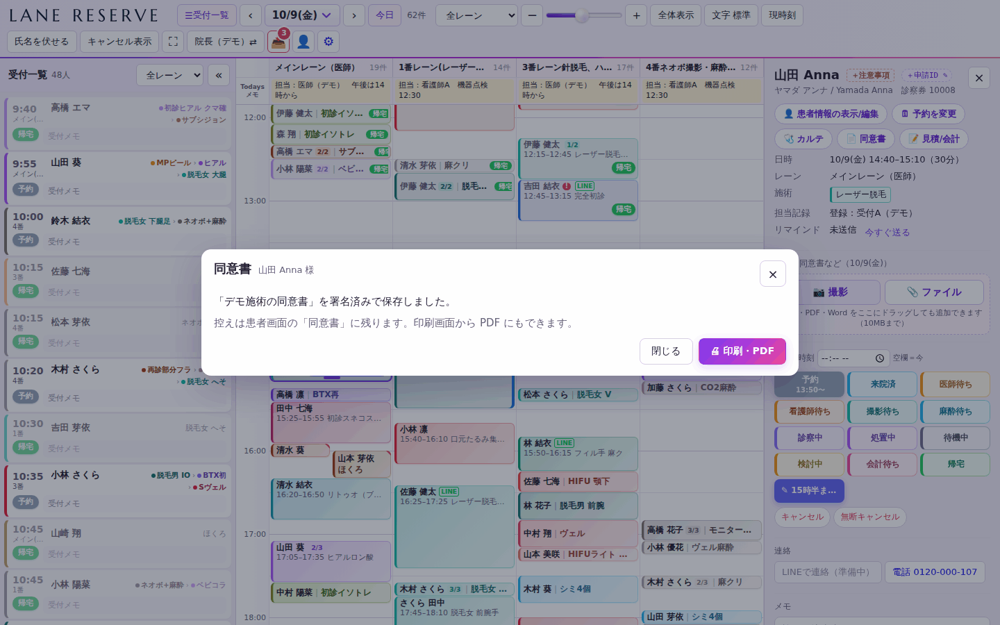

同意書のひな形が1つもないときは「同意書のひな形がまだありません」と出ます（設定 → 同意書／取り込み で用意します）。写真の同意書は、マニュアル用に作った架空のひな形です。

**【未確認】** Googleドライブから最新の文面を読み込む仕組み（読み込み元の設定）は、デモでは設定していません。

### 10-3. 見積・会計

1. 詳細パネルの **📝 見積/会計** を押します。右上で **御見積書／御会計書** を切り替えます（端末ごとに前回の選択を覚えます）。
2. 「この予約のメニューに合う料金」や「料金表」「スキンケア＆内服」の一覧から項目を押して追加します。「さがす」で探せます。
3. 単価・数量を直します。「＋自由入力の行」「＋割引（掛け率）」「＋割引（金額）」も使えます。合計（税込）と消費税が自動で出ます。
4. 発行日・有効期限・備考を確かめ、**御見積書を作る**（会計書なら御会計書を作る）を押します。 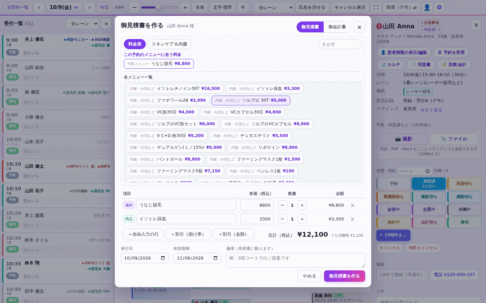
5. 保存されると番号（例：No.2026-0001）が付き、印刷できます。 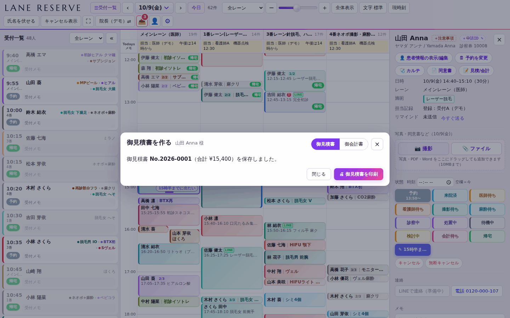

患者画面の下の「同意書」「見積・会計」に控えの一覧があり、印刷・直す・削除（管理操作のできる人）ができます。

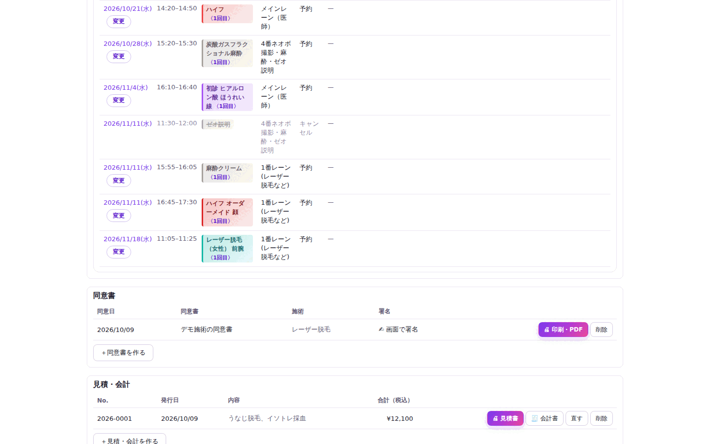

---

## 11. 1日の流れ（朝・診療中・終業）

### 朝（診療前）

1. 自分の名前でログインします（[2章](#2-ログイン)）。
2. 「今日」を押して今日の予約表を開き、「全体」で1日をざっと見ます。
3. 予約枠の **「!」（注意事項）** と **赤い三角（重なり）** を確かめます。重なりは必要なら動かします。
4. **Todaysメモ** に担当スタッフ・機器の点検など、その日の注意を書きます。
5. 受付の画面が患者から見える場所なら「氏名を伏せる」を押します。

### 診療中

1. 患者が来たら、受付一覧または詳細パネルで **来院済** にします。
2. 待ち・診察中・処置中・会計待ちと進むたびに状態を変えます。急ぎの一言は「＋自由入力」。
3. 施術の内容は **🩺 カルテ**、写真は **📷 撮影**、同意書は **📄 同意書** で残します。
4. 会計時は **📝 見積/会計** で会計書を作り、終わったら **帰宅** にします。
5. 次回の予約は、予約表の空いている所を押して入れます（日付のカレンダーの「4週後」などが便利です）。
6. 電話でのキャンセルは **キャンセル**、来なかった人は **無断キャンセル** にします（必ず「はい」の確認が出ます）。
7. ほかの端末で変えた内容は20秒ごとに反映されます。すぐ見たいときはページを開き直します。

### 終業

1. 今日の予約が全部「帰宅」かキャンセル系になっているか、受付一覧で確かめます。
2. 翌日の予約表を開き、注意事項・重なりを確かめます。
3. 共用の端末では「名前 ⇄」でログアウトします。
4. バックアップ・リマインドは院のサーバーの設定で動きます。大きな変更をした日は、院長・管理者が 設定 →「控え・復元」の **「今すぐ控えを取る」** で控えを取っておくと安心です（[13章](#控え復元院長管理者のみ)）。

---

## 12. スマホでの使い方

スマホでは上のバーが2〜3段になり、ボタンが短い名前になります（伏字＝氏名を伏せる、取消＝キャンセル表示）。LANE RESERVE のロゴは出ません。受付一覧は最初たたまれています。

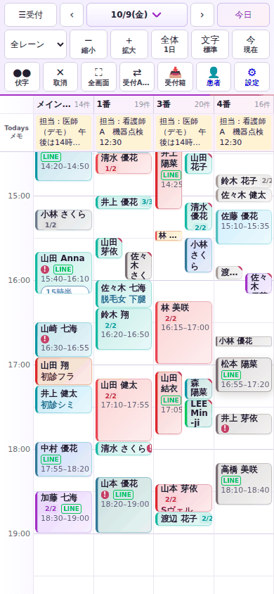

1. **予約を見る**：予約枠を押すと、詳細が **下から** 出ます。上下にスクロールして状態のボタンなどを使います。× で閉じます。 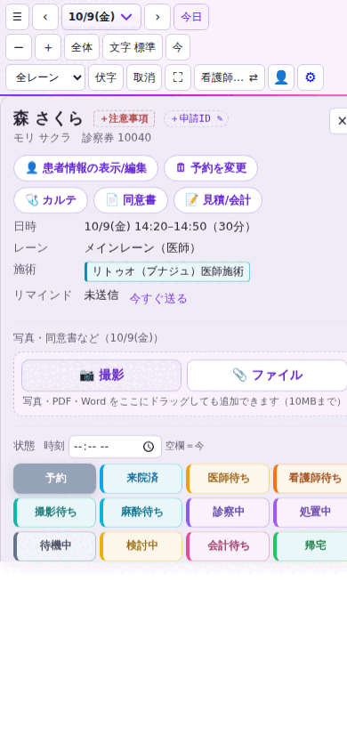 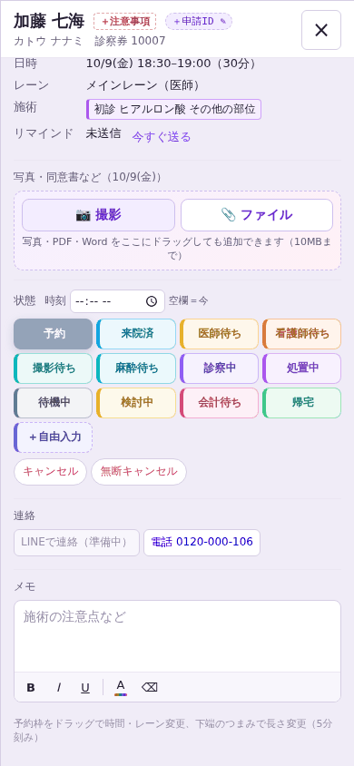
2. **1レーンだけ表示**：左上の「全レーン」の選択（①）で1つのレーンを選ぶと、そのレーンだけが画面の幅いっぱいに出ます。自分の担当レーンだけ見るときに便利です。 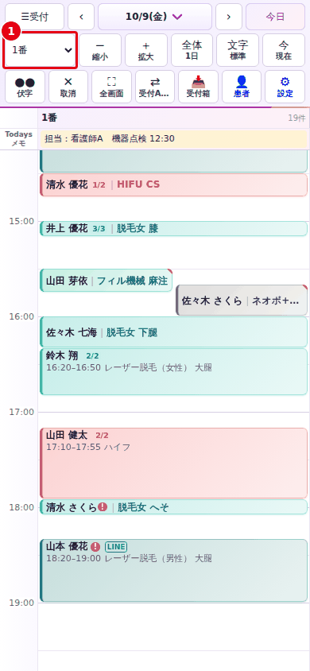
3. **受付一覧**：左上の「☰」で開きます。行を押すと一覧が閉じて、その予約の詳細が出ます。 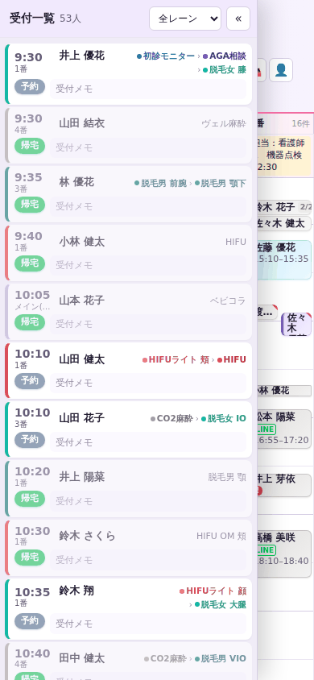
4. **拡大・縮小**：2本指でピンチします。
5. **予約を動かす**：枠を **長押し** してから動かします（普通に触ったときはスクロール）。
6. 全画面（⛶）にできない端末は、ブラウザの「ホーム画面に追加」を使うと広く使えます。

---

## 13. 設定（院長・管理者向け）

予約表の右上の **⚙** で開きます。上のタブで切り替えます。**スタッフ・操作ログ・控え・復元** のタブは院長・管理者にだけ出ます。**リマインド** のタブは院長・管理者と、管理操作のできる人に出ます。変更できない人には「このログインでは見るだけです」と出ます。

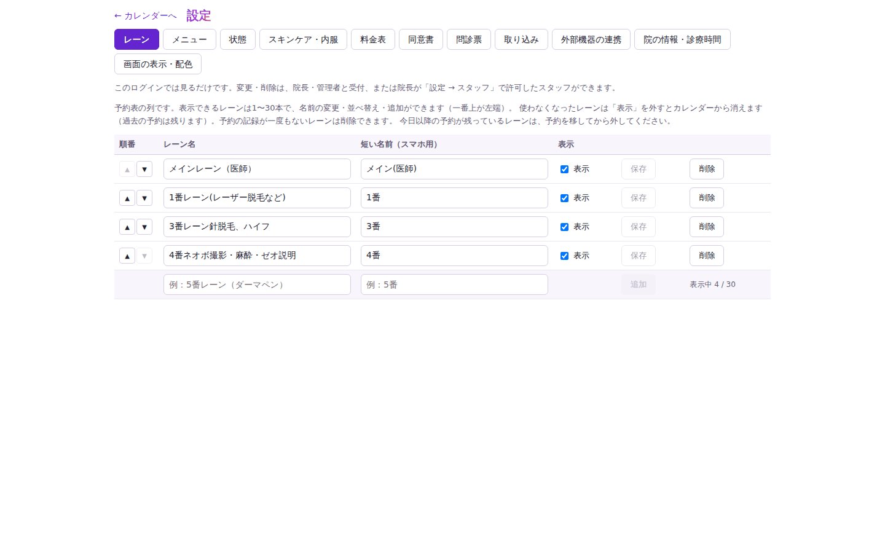

### レーン

名前・短い名前（スマホ用）・並べ替え（▲▼、一番上が左端）・表示の切り替え・追加・削除。表示できるのは1〜30本。今日以降の予約が残るレーンは非表示にできず、予約の記録が一度もないレーンだけ削除できます。

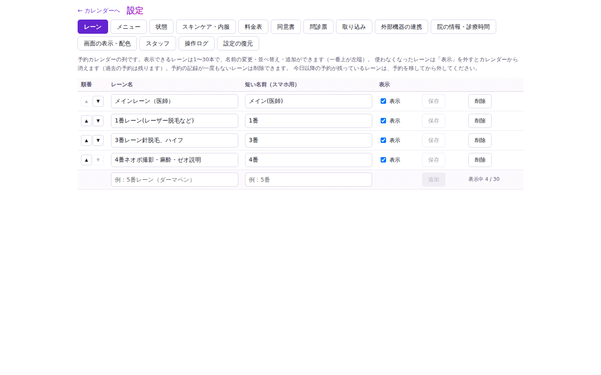

### メニュー

予約で選ぶメニューの一覧。「＋ 新しいメニュー」で追加、行を押すと編集画面が開きます。メニュー名・略称（短い枠に出る）・色・**患者に見せる名前**・**来院前の案内**（①、どちらもリマインドに入ります。[リマインド](#リマインド) を参照）・提供時間（固定／最小〜最大と刻み）・予約時の初期値・開始時間の刻み・料金・同時予約数・行えるレーン・予約の選択肢に出すか、を決めます。削除しても過去の予約の表示は残ります。

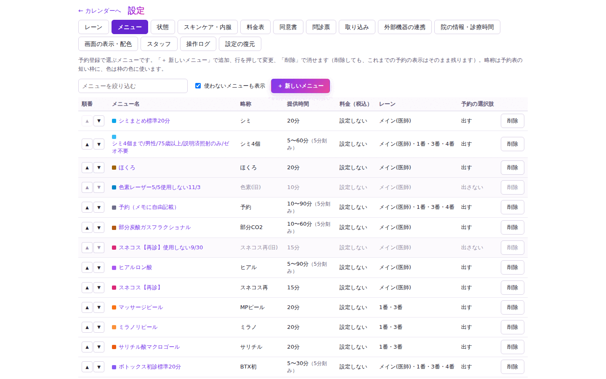
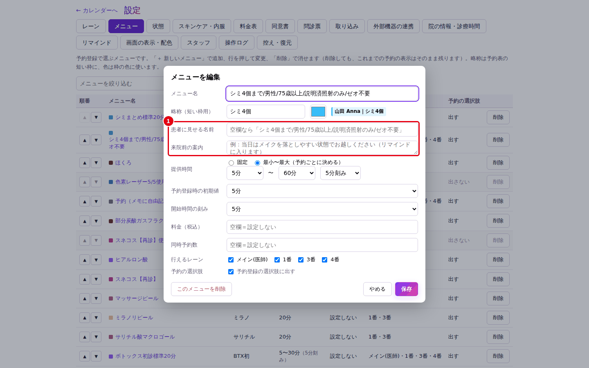

**【未確認】**「開始時間の刻み」「同時予約数」は保存はされますが、予約登録のときの制限に使われているかは確認していません（README では未使用と書かれています）。

### 状態

詳細パネルに並ぶ状態のボタン。名前・色・段階（来院前／来院・待ち／診察・施術中／会計／終了）・自由入力にするか・予約詳細に出すか。段階はリマインドの対象や回数の数え方に使います。

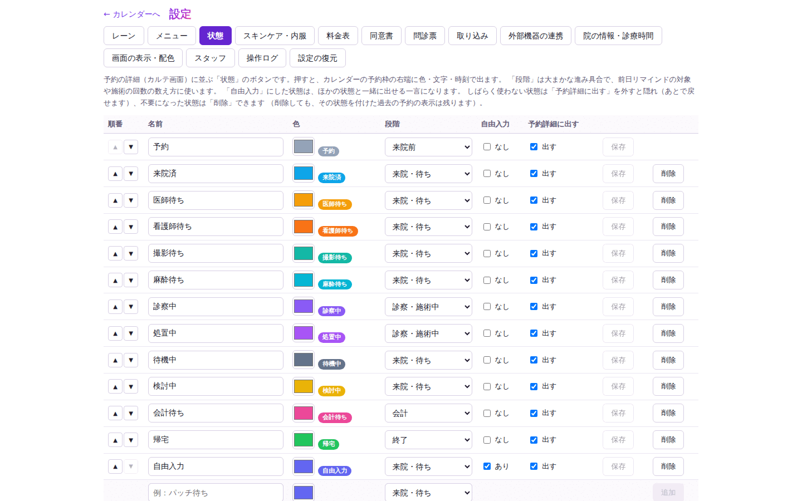

### スキンケア・内服／料金表／取り込み

- **スキンケア・内服**：料金表にない商品を1つずつ足します。 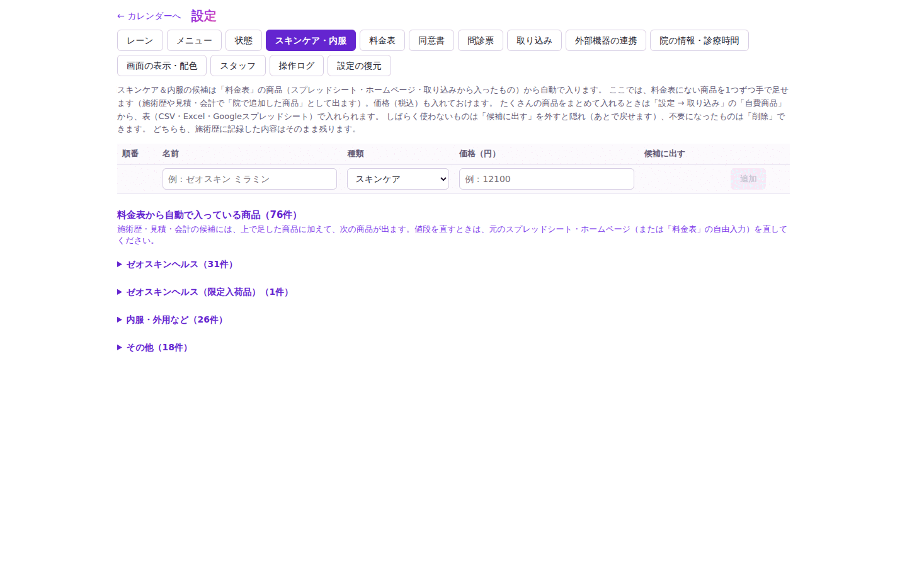
- **料金表**：見積書で選べる料金。ホームページやスプレッドシートから自動で取り込み、足りない分は自由入力で足します。 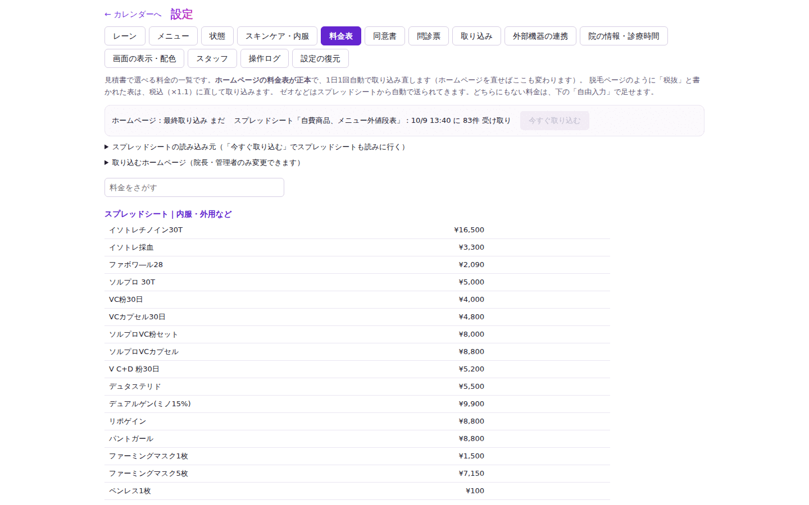
- **取り込み**：メニュー・料金表・自費商品・同意書のひな形を、CSV・Excel・Word・Googleの共有リンクからまとめて取り込みます。中身を表で確かめてから「取り込む」を押します。下には、電子カルテの患者一覧（CSV）と照合して漢字の氏名などを補う機能もあります（院長・管理者）。 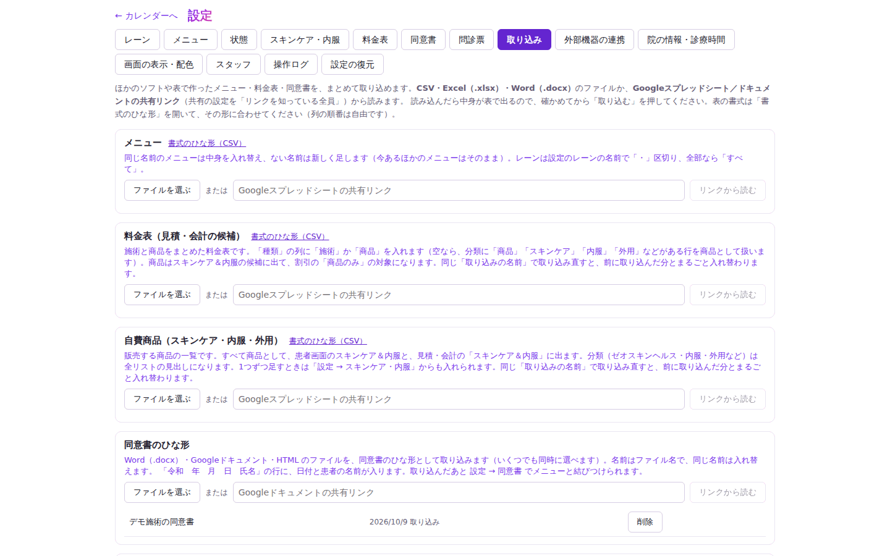

### 同意書／問診票

- **同意書**：Googleドライブの同意書フォルダとつなぐ設定（院長・管理者）と、ひな形とメニューの結びつけ。 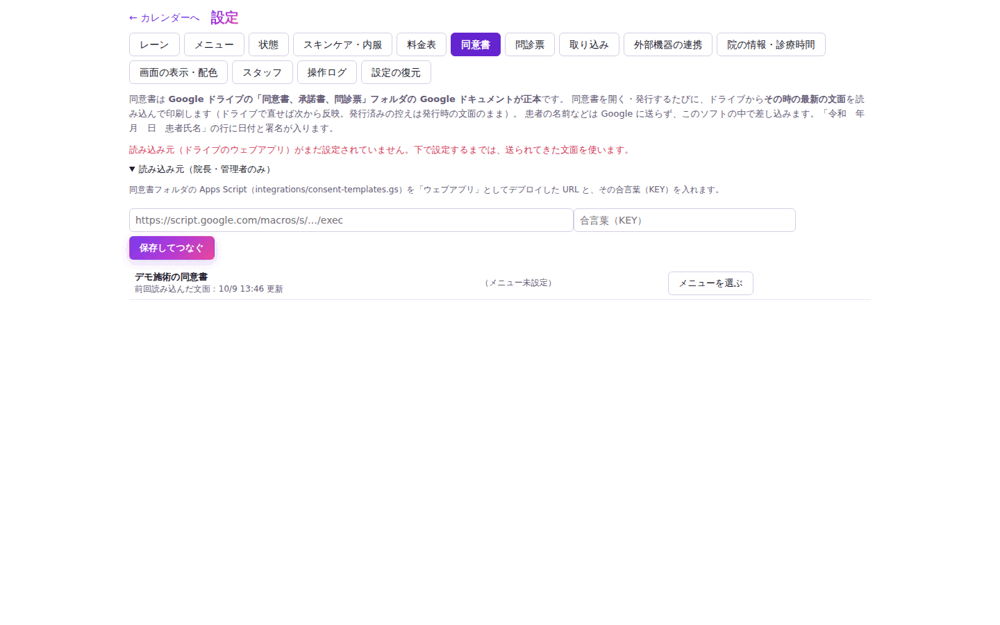
- **問診票**：結びつかなかった回答の一覧（[9章](#9-問診票)）。

### 外部機器の連携

ネオボワール（肌診断機）の写真の取り込み、Googleの問診票・同意書・料金表が送るときの鍵の発行、名前で患者が決まらなかった写真（照合待ちの写真）の結びつけ。鍵の発行は院長・管理者のみです。

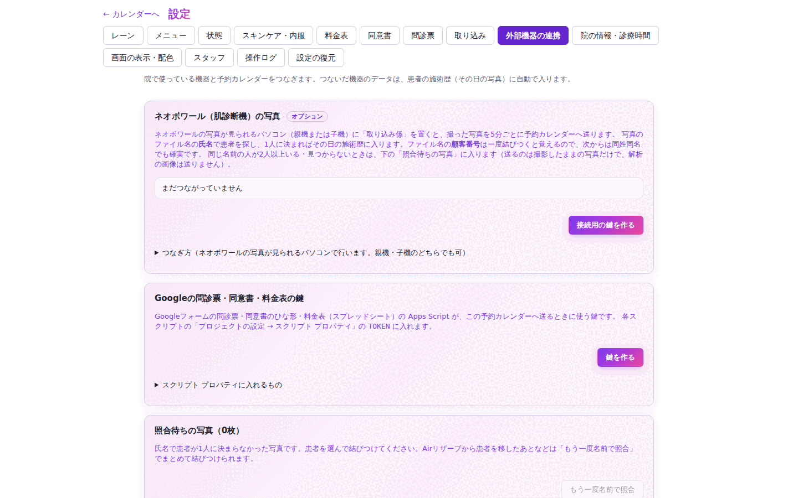

### 院の情報・診療時間

院名・開院／閉院時間・予約の刻み（5／10／15／30分）と、見積書・同意書に載せる院の情報（書類に載せる院名・住所・電話番号・発行者・見積書の有効期限と用紙・見積書の注意書き）。

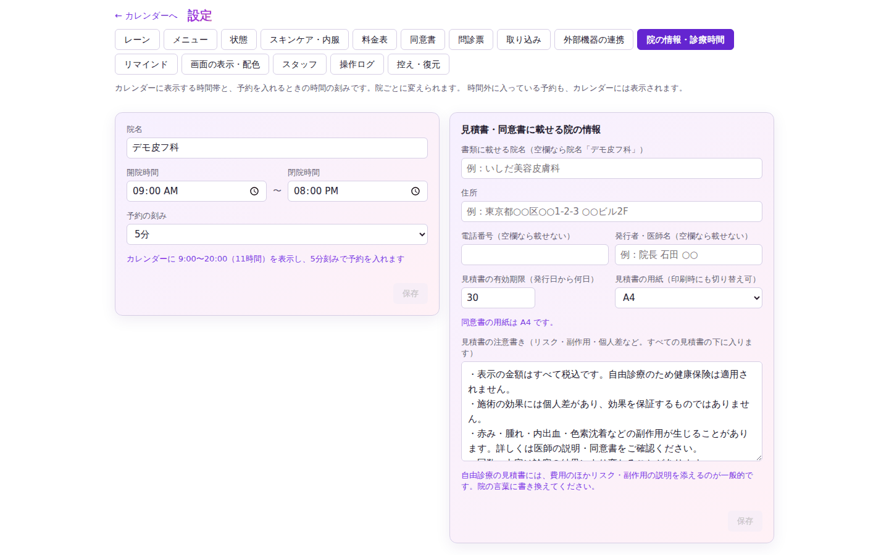

### リマインド

予約のお知らせ（リマインド）とAirリザーブの取り込みの設定は、「院の情報・診療時間」から **「リマインド」** のタブに移りました。

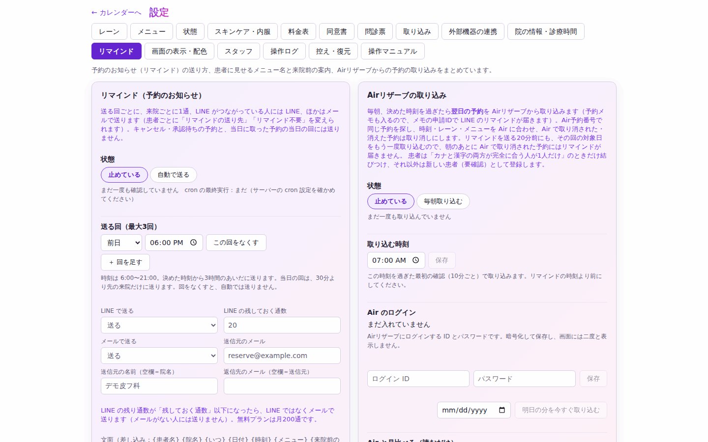

- **リマインド（予約のお知らせ）**（院長・管理者）：LINE・メールで予約のお知らせを送る設定（送る回は最大3回・何日前・時刻は6〜21時、LINEの鍵、送信元メールなど）。本文には `{患者名}` `{院名}` `{いつ}` `{日付}` `{時刻}` `{メニュー}` `{来院前のご案内}` `{院の電話}` を入れられます。予約の詳細の「今すぐ送る」で1件だけ送ることもできます。
- **Airリザーブの取り込み**（院長・管理者）：毎朝、決めた時刻を過ぎたら翌日分の予約をAirリザーブから取り込む設定（取り込む時刻、AirのログインID・パスワード、取り込む日を選んで今すぐ取り込む）。Air予約番号で同じ予約を探して時刻・レーン・メニューをAirに合わせ、Airで取り消された・消えた予約は取り消しにします。リマインドを送る20分前にも、その回の対象日をもう一度取り込みます。既存の患者と結びつけられず新しく登録した患者は **「要確認」** の一覧に出て、予約の詳細の名前の横にも赤い「要確認」が出ます。同じ人がいれば患者画面で統合し、別の人なら一覧の「確認済み」を押します。
- **Air と見比べる（読むだけ）**（院長・管理者）：期間（一度に62日まで、過去の日も可）を選んで「見比べる」を押すと、Airの予約とLANE RESERVEの予約（Air予約番号つき）を見比べ、違う人・時刻やレーンのずれ・片方にしかない予約・同じ予約番号の二重を一覧にします。何も書き換えません。
- **リマインドで見せるメニュー**（管理操作のできる人）：メニューごとに **「患者に見せる名前」**（リマインドの `{メニュー}` に入る。空欄ならメニュー名。院内の略称【再診】などを患者に見せないため）と **「来院前の案内」**（本文の最後、または `{来院前のご案内}` の場所に入る。1回の来院に複数のメニューがあるときはまとめて1回だけ）を入れ、行ごとに「保存」を押します。「まだ入れていないものだけ」で絞り込めます。メニューの編集画面でも同じ欄を直せます。
- **予約申請のLINEを患者に紐付ける**：予約申請IDのLINEが見つかり、名前・生年月日が患者と合うとき、詳細パネルの申請IDの横に「LINE（申込者）」と「＋患者に紐付け」が出ます。家族が代わりに申し込んだ場合は紐付けないでください。

**【未確認】** リマインド・Airリザーブの取り込み・Airとの見比べ・申請からのLINE紐付けは **本番（PHP版）だけで動く機能** で、この写真を撮った開発版では「この版では使えません」と表示されます。要確認の一覧・見比べの結果・LINE紐付けの確認画面・リマインドの本文に案内が入る様子は撮影できませんでした。

### 画面の表示・配色

院の配色（すべての端末）と、この端末だけの表示（予約の枠に出す情報、受付一覧を開いておくか、文字の大きさ）。

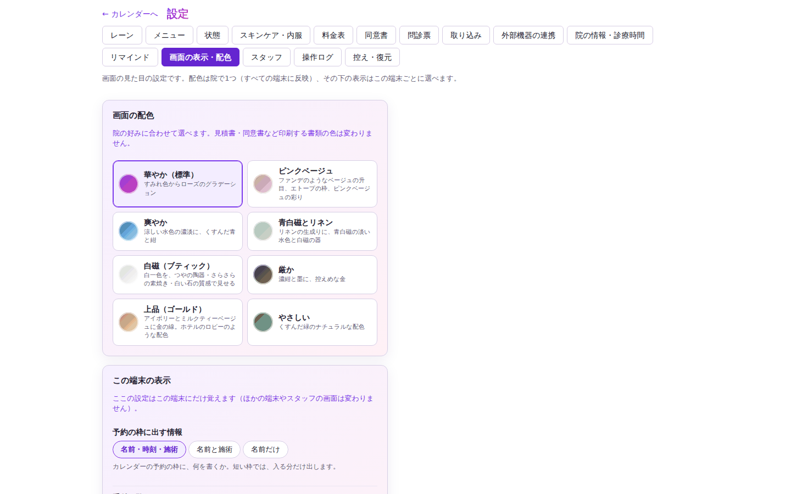

### スタッフ（院長・管理者のみ）

名前・役割（院長・管理者／医師／看護師／受付）・利用中（外すと利用停止）・**管理操作** の許可・PINの変更・追加。PINの変更・利用停止・役割の変更をすると、その人のログインは切れます。院長・管理者は最低1人必要です。

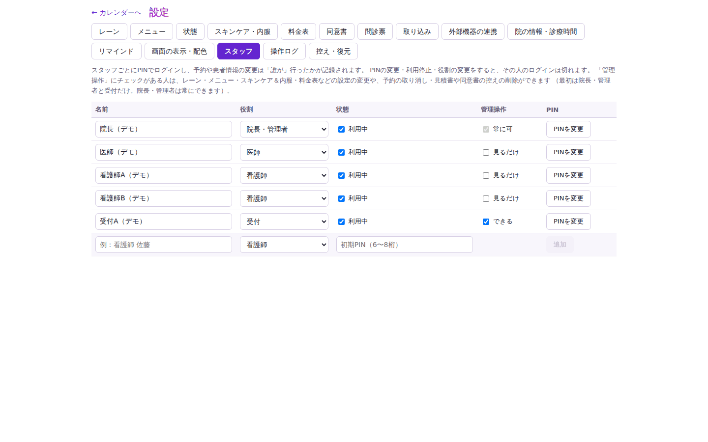

### 操作ログ（院長・管理者のみ）

ログイン・予約・患者情報・設定の操作を新しい順に直近300件表示します。患者情報の中身は記録しません。

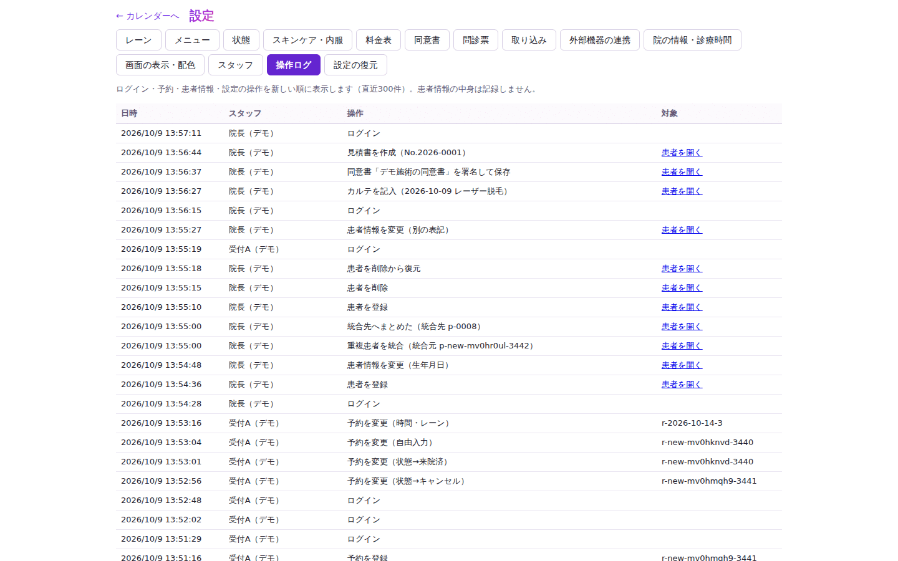

### 控え・復元（院長・管理者のみ）

以前の「設定の復元」のタブです。上に **データの控え（バックアップ）**、下に **設定の復元** があります。

**データの控えを取る**

予約・患者・記録・設定をまとめた控えを、サーバーの中に今すぐ作ります。取り込み・統合・一括の直しなど、大きな変更の前に押してください。控えは外に送らず、サーバーの中にだけ置きます。

1. 予約表の ⚙ →「控え・復元」のタブを開きます。
2. **「今すぐ控えを取る」**（①）を押します。 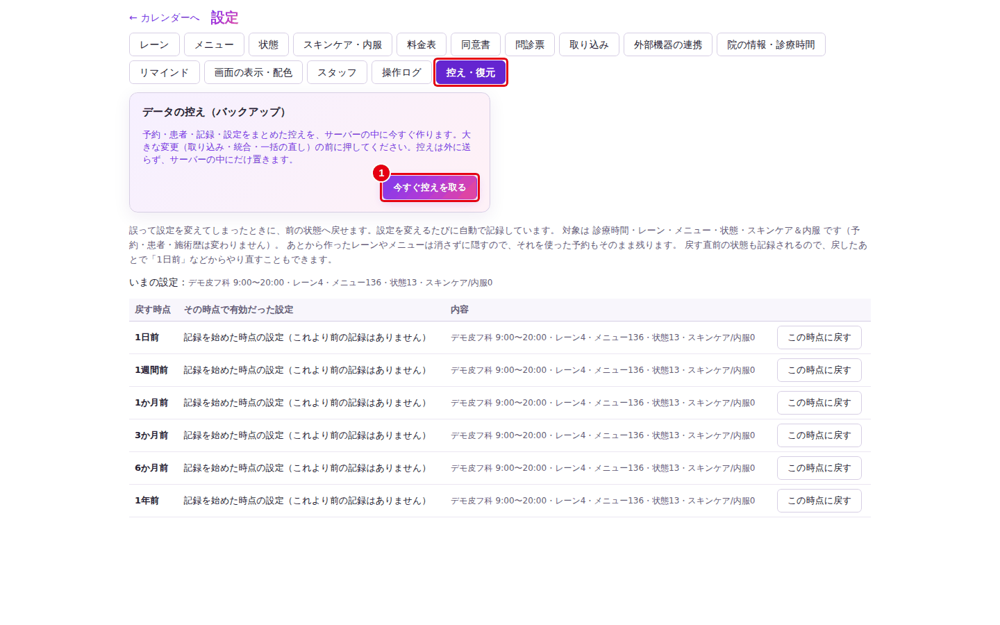
3. 「いまのデータの控えを作ります。少し時間がかかることがあります。よろしいですか？」と出るので **OK** を押します。
4. 「控えを作りました（○MB・確認 ok）」と出て、カードの下に作った日時・ファイル名・大きさが出ます。 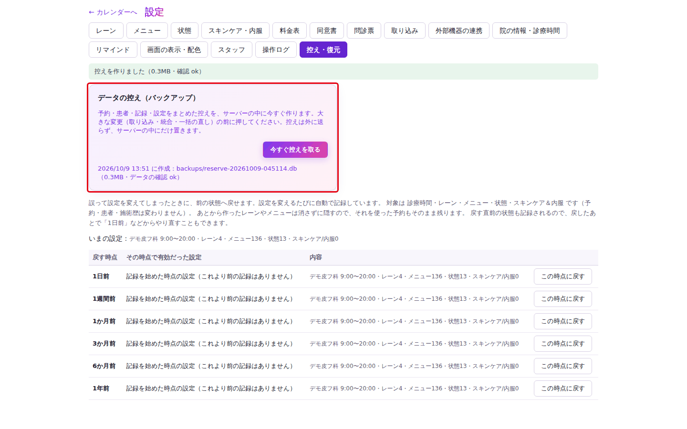

**設定の復元**

誤って設定を変えたとき、1日前・1週間前などの状態に戻せます。対象は診療時間・レーン・メニュー・状態・スキンケア＆内服で、予約・患者・施術歴は変わりません。戻したい時点の「この時点に戻す」を押します。

### バックアップ

- 毎日の控えは、サーバーで `npm run backup`（Node.js版）を決まった時刻に動かす運用です。上の「今すぐ控えを取る」は、それとは別に手で控えを取るためのものです。院長・管理者が画面から行う機能（電子カルテ照合の反映など）では、書き換える前に自動で控えを取ります。
- PHP版（本番）のバックアップの手順は `apps/reserve/php/README.md` を見てください。

**【未確認】** 「今すぐ控えを取る」で作った控えから元に戻す（復元する）操作は画面にありません。控えから戻すときはサーバーでの作業になります。本番（PHP版）で控えが作られることは、開発版でしか確かめていません。

---

## 14. 困ったとき（FAQ）

**Q. 保存できない／「保存できませんでした」と出る**
- 画面の下に赤い知らせが出たら、その文を読んでください。通信が切れていないか確かめ、ページを開き直してからもう一度行います。
- 予約の登録では、患者・メニューを選んでいない、診療時間を超えている、などの理由が赤字で出ます（[4-2](#4-2-出てくる警告)）。
- 設定の変更で「この操作の権限がありません」と出たら、管理操作のできる人に頼んでください（[15章](#15-役割ごとにできること)）。

**Q. 「他の端末で先に更新されました」と出た（同時に編集した）**
- ほかの人が同じ予約・患者・記録を先に変えています。上書きはされません。予約表は自動で最新に読み直されます。患者画面では「最新の内容を読み込む」を押し、もう一度直してください（[8-9](#8-9-ほかの人が同時に同じ患者を直したとき)）。

**Q. ログインできない／「5分間ログインできません」と出た**
- PINを5回続けて間違えたためのロックです。表示された時間を待ってから入れ直してください。続けて間違えると、ロックの時間が長くなります。
- PINを忘れたときは、院長・管理者に設定 → スタッフ →「PINを変更」で新しいPINにしてもらいます。
- 「利用停止」になっていると名前が出ません。院長に確認してください。
- 院の入口のパスワード（Basic認証）を聞かれて分からないときは院長に聞いてください。

**Q. 急にログイン画面に戻った**
- ログインは12時間で切れます。また、PINの変更・役割の変更・利用停止があると、その人のログインは切れます。

**Q. 予約枠を押しても動かない・ずれる**
- スマホ・タブレットでは長押ししてから動かします。動かしたあと「はい」を押すまでは保存されません。

**Q. 空いている所を押しても予約画面が出ない**
- 詳細パネルが開いているときは、1回目の押しで詳細が閉じます。もう一度押してください。診療時間の外は押しても開きません。

**Q. キャンセルした予約が見えない**
- 「キャンセル表示」を押すと薄く表示されます。

**Q. 間違えてキャンセル（無断キャンセル）にしてしまった**
- 「キャンセル表示」を押し、その予約の枠を押して詳細を開き、**「予約に戻す」** →確認で **OK** を押します（[7-3](#7-3-取り消した予約を予約に戻す)）。入れ直す必要はありません。

**Q. バックアップ（控え）を取りたい**
- 院長・管理者が 設定 →「控え・復元」の **「今すぐ控えを取る」** を押します（[13章](#控え復元院長管理者のみ)）。取り込み・統合などの大きな変更の前に押しておくと安心です。院長・管理者以外のログインでは、このタブは出ません。

**Q. 予約表の時刻の範囲を変えたい**
- 設定 → 院の情報・診療時間 で開院・閉院時間を変えます（管理操作のできる人）。時間外の予約も表示はされます。

**Q. 文字が小さい**
- 上のバーの「文字」で、標準→大きめ→特大と切り替わります（この端末だけ）。

---

## 15. 役割ごとにできること

「管理操作」は、院長・管理者は常にでき、受付は初期状態でできます。医師・看護師にも、院長が設定 → スタッフ で「管理操作」にチェックを入れると許可できます。

| できること | 院長・管理者 | 受付 | 医師 | 看護師 |
| --- | :---: | :---: | :---: | :---: |
| 予約表・受付一覧・患者画面を見る | ○ | ○ | ○ | ○ |
| 予約を入れる・動かす・長さを変える・予約を変更 | ○ | ○ | ○ | ○ |
| 状態を付ける・自由入力・予約メモ・受付メモ・Todaysメモ | ○ | ○ | ○ | ○ |
| 詳細パネルの「キャンセル」「無断キャンセル」「予約に戻す」 | ○ | ○ | ○ ※1 | ○ ※1 |
| 「予約を変更」画面の「予約を取り消す」 | ○ | ○ | 許可時 | 許可時 |
| 患者の登録・基本情報の編集・注意事項 | ○ | ○ | ○ | ○ |
| カルテ・写真・同意書の発行・見積書／会計書の作成 | ○ | ○ | ○ | ○ |
| 問診票を診察券番号で結びつける | ○ | ○ | ○ | ○ |
| 患者の削除・復元・統合・統合の取り消し | ○ | ○ | 許可時 | 許可時 |
| 同意書・見積書の控え、問診票の回答の削除 | ○ | ○ | 許可時 | 許可時 |
| カルテの削除 | ○ | ○ | 書いた本人／許可時 | 書いた本人／許可時 |
| レーン・メニュー・状態・スキンケア・料金表・診療時間・配色・取り込み・リマインドで見せるメニュー | ○ | ○ | 許可時 | 許可時 |
| スタッフ・操作ログ・控え・復元（今すぐ控えを取る・設定の復元） | ○ | × | × | × |
| リマインド・Airリザーブの取り込み・Airとの見比べ・同意書の読み込み元・外部連携の鍵・電子カルテ照合 | ○ | × | × | × |
| 受付箱（LINE予約申請）を見る・「済み」「見送り」にする | ○ | ○ | ○ | ○ |

※1 コード上は、ログインしているスタッフ全員にボタンが出て、サーバー側も役割で止めていません。**【未確認】** 画面で押して確かめたのは受付のみです（「予約に戻す」も受付で確かめました）。院の運用で、だれが押してよいかを決めてください。

---

## 16. AI・開発者向けメモ

- **コードの場所**：`apps/reserve/`（Next.js）。画面は `src/app/`（`page.tsx`＝予約表、`login/`、`patients/`、`patients/view/`、`settings/`、`consents/print/`、`estimates/print/`）、部品は `src/components/`（`calendar/` 予約表・詳細・登録、`patients/`、`settings/`、`consents/`、`estimates/`、`charts/`、`questionnaires/`）、サーバー側は `src/lib/server/`（`store.ts` 保存と業務ルール、`session.ts`・`staff.ts` ログインと権限）、デモデータは `src/lib/demo/seed.ts`。共用サーバー用のPHP版は `php/`（APIと保存形式は同じ）。
- **APIの入口**：本番では `/reserve/api/v1`（例：`/reserve/api/v1/day?date=YYYY-MM-DD`）。開発版（`npm run dev`）では `/api/v1`。権限は `requireStaff`（ログイン中のスタッフ）、`requireManager`（管理操作）、`requireStaff(request, ["admin"])`（院長・管理者のみ）で決まります。
- **名前とロゴ**：サービス名は LANE RESERVE（レーンリザーブ）。ロゴ・アイコンは `public/brand/`（ログイン画面は `lane-reserve-logo.svg`、上のバーは `lane-reserve-logo-horizontal.svg` で横1280px以上のときだけ表示）、ホーム画面用は `public/manifest.webmanifest`、タブの題名は `src/app/layout.tsx`（「○○｜LANE RESERVE」）。
- **控え**：「今すぐ控えを取る」は `POST /api/v1/admin/backup`（`{"confirm":"BACKUP"}`、院長・管理者のみ）。開発版ではデータフォルダの `backups/` に作られます。
- **受付箱**：`GET /api/v1/intake`・`POST /api/v1/intake/{申請ID}/mark`。PHP版だけが申請を読み、開発版では空（「この版では使えません」）。
- **同時編集**：予約・患者などは `version` を持ち、古い版での保存は「他の端末で先に更新されました」で止まります（409）。
- **デモ**：`RESERVE_DEMO=1`（開発の既定）で架空の患者・予約が入ります。デモのPINは全員 `1234`。デモの予約は日付ごとに同じものが作られます（水曜・日曜は混む日）。
- **運用のルール**：予約・患者などの運用データは院の運用ルールの対象です。**患者の情報（氏名・電話・カルテ内容など）を、ログ・チャット・課題管理・AIへの指示文に書かないでください。** 調べるときは架空のデモデータを使い、本番のデータや本番の画面・APIには触れないでください。
- このマニュアルの写真は開発版（Node.js、デモデータ）で撮影しました。本番（PHP版）だけの機能（リマインド送信、Airリザーブ取り込みとAirとの見比べ、受付箱、申請からのLINE紐付け）は撮影できていません。
